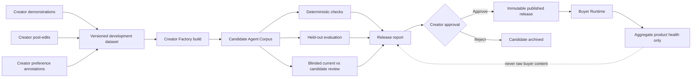
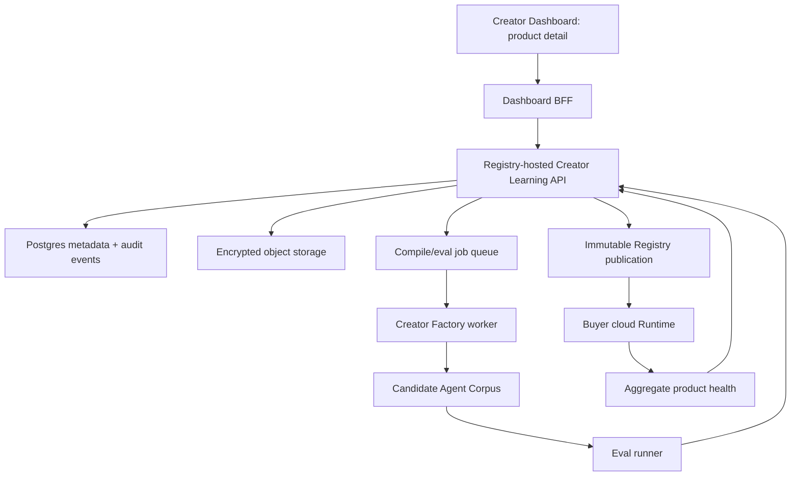

# Hatch Creator Coactive Learning v1

Status: Deferred future exploration — not part of Creator Factory v1
Audience: Product, Design, Factory, Runtime, Registry, Dashboard, Data, Security
Scope: A non-invasive system for improving one Creator Agent from Creator-owned examples, post-edits, and comparisons over time

> The implemented pre-release distillation workflow is documented in
> [`creator-factory-implementation-v1.md`](./creator-factory-implementation-v1.md).
> It has no end-user evaluation, online learning, post-edit collection, or
> pairwise preference loop. This document is retained only as possible future
> research and must not be treated as the current product contract.

## 0. Decision summary

Hatch should not build an "Expert Action Tracker." It should implement a
Creator-scoped **coactive learning** workflow:

1. A Creator deliberately enters a `Test & improve` surface for one product.
2. The current Agent produces a draft from a Creator-owned test case.
3. The Creator accepts, post-edits, rejects, or compares drafts.
4. Hatch records that feedback with provenance in a versioned dataset.
5. The Factory builds an immutable candidate Agent Corpus from a frozen dataset
   version.
6. Hatch evaluates the candidate against the current published release.
7. The Creator sees the material behavior changes and explicitly approves or
   rejects publication.

The system learns only from data deliberately placed in this workflow. It does
not continuously observe email, Slack, documents, browser activity, or buyer
workspaces. Buyer inputs and local files are runtime-only by default and are not
eligible for Creator learning.

### First useful version

> When a Creator supplies a Markdown test case and improves the Agent's Markdown
> draft, Hatch stores the proposal-to-post-edit pair as Creator-scoped feedback,
> builds a candidate Agent Corpus, runs held-out evaluations against the current
> release, and asks the Creator to approve publication. The workflow succeeds
> when the candidate passes deterministic safety and quality gates and the
> Creator approves it, without using buyer-private data.

This is an extension of Hatch's current Creator Factory and immutable release
lifecycle. It is not online model training and it is not a general labeling
platform.

## 1. Research basis and terminology

This specification reuses established concepts rather than introducing new
technical nouns.

| Hatch requirement | Established concept | Meaning in this specification |
| --- | --- | --- |
| Start from examples of the Creator's work | Learning from Demonstration (LfD) | A `demonstration` is a Creator-authored input/output example. LfD commonly represents examples as state-to-action mappings; Hatch uses task context-to-artifact examples. |
| Learn when the Creator improves an Agent draft | Coactive learning; post-editing | The edited artifact is treated as an improvement over the proposal, not automatically as a perfect answer. |
| Ask which of two outputs is better | Pairwise preference learning | A blinded A/B choice produces a preference pair and optional rubric labels. |
| Collect labels on the states the system actually reaches | Dataset aggregation | Creator corrections on Agent-generated drafts complement static historical examples and reduce train/serve distribution mismatch. Hatch follows the data-collection pattern; it does not claim to implement the DAgger algorithm for all workflows. |
| Ask only a few high-value questions | Active learning | Select review items using error triggers, uncertainty, disagreement, novelty, and a small random audit sample. |
| Defer when the Agent is not reliable | Selective prediction / abstention | The Agent requests missing information or Creator review instead of forcing a result. |
| Give the Creator a focused review inbox | Annotation queue | A bounded queue with a rubric, progress state, and single-run or pairwise review. |
| Freeze exactly what was used for a build | Dataset version | An immutable membership snapshot with hashes and provenance. |
| Compare a candidate with the live version | Champion/challenger release lifecycle | The current published release remains live until a candidate passes gates and is approved. |
| Explain where an example and release came from | Data provenance / lineage | Use W3C PROV's `Entity`, `Activity`, `Agent`, and derivation relationships as the conceptual model. |
| Exchange domain events consistently | CloudEvents | Use the CloudEvents envelope and JSON Schema for append-only audit events. |
| Observe execution without mixing telemetry with domain data | OpenTelemetry traces | Use spans, metrics, and logs for operations; keep raw Creator content out of span attributes. |
| Limit intrusive data collection | Purpose limitation, data minimization, privacy by design/default | Collect only the data required for the declared improvement workflow, with safe defaults and revocable controls. |

Research implications:

- The most directly applicable result is **coactive learning for LLMs**: a user
  edit gives a weak preference `post_edit > proposal`; it is not necessarily a
  supervised gold answer. This prevents Hatch from over-interpreting rushed,
  partial, or noisy edits.
- Preference comparisons can reduce reviewer effort, but feedback remains noisy.
  Release decisions therefore need held-out evaluation and explicit Creator
  approval rather than direct online updates.
- Active learning and selective prediction are complementary: the system
  should both choose informative cases for review and abstain on uncertain live
  cases.
- Established human-AI interaction guidance says to explain what feedback is
  used for, provide granular and global controls, adapt cautiously, and notify
  users when behavior changes. Those requirements are part of the product, not
  optional policy copy.
- Annotation queues already exist as a standard review surface: single-run
  rubrics, pairwise comparisons, reviewer progress, and export to versioned
  datasets. Hatch should reuse this interaction grammar.

Primary and official sources:

- [A survey of robot Learning from Demonstration](https://www.cs.cmu.edu/~mmv/papers/09ras-survey.pdf)
- [DAgger: A Reduction of Imitation Learning and Structured Prediction to No-Regret Online Learning](https://proceedings.mlr.press/v15/ross11a.html)
- [Coactive Learning for Large Language Models using Implicit User Feedback](https://proceedings.mlr.press/v235/tucker24a.html)
- [Deep Reinforcement Learning from Human Preferences](https://papers.nips.cc/paper/7017-deep-reinforcement-learning)
- [ASPEST: Active Learning and Selective Prediction](https://research.google/pubs/aspest-bridging-the-gap-between-active-learning-and-selective-prediction/)
- [Google PAIR: Mental Models](https://pair.withgoogle.com/guidebook-v2/chapter/mental-models/)
- [Google PAIR: Feedback + Control](https://pair.withgoogle.com/guidebook-v2/chapter/feedback-controls/)
- [Microsoft: Guidelines for Human-AI Interaction](https://www.microsoft.com/en-us/research/group/customer-insights-research/articles/guidelines-for-human-ai-interaction-eighteen-best-practices-for-human-centered-ai-design/)
- [LangSmith annotation queues](https://docs.langchain.com/langsmith/annotation-queues)
- [LangSmith evaluator alignment with human feedback](https://docs.langchain.com/langsmith/improve-judge-evaluator-feedback)
- [W3C PROV-O](https://www.w3.org/TR/prov-o/)
- [CloudEvents specification](https://github.com/cloudevents/spec/blob/main/cloudevents/spec.md)
- [OpenTelemetry signals](https://opentelemetry.io/docs/concepts/signals/)
- [GDPR Article 5 and Article 25](https://eur-lex.europa.eu/legal-content/EN/TXT/?uri=CELEX%3A32016R0679)
- [EDPB Guidelines on Data Protection by Design and by Default](https://www.edpb.europa.eu/documents/guideline/guidelines-42019-on-article-25-data-protection-by-design-and-by-default_en)
- [Microsoft Event Sourcing pattern and trade-offs](https://learn.microsoft.com/en-us/azure/architecture/patterns/event-sourcing)
- [MLflow model version, alias, and registry workflow](https://www.mlflow.org/docs/latest/ml/model-registry/workflow/)

### Terms Hatch should use

- `demonstration`
- `post-edit`
- `preference pair`
- `annotation`
- `annotation queue`
- `dataset` and `dataset version`
- `training`, `validation`, `test`, and `regression` split
- `run trace`
- `provenance`
- `candidate release` and `current release`
- `abstention` or user-facing `needs review`

### Terms Hatch should not introduce

- Do not call the system an `Expert Action Tracker`.
- Do not rename an edit log to a `Decision Trace` unless the product actually
  observes a bounded decision, its available alternatives, and its context.
- Do not call all historical information `memory`; distinguish source material,
  examples, annotations, runtime state, and release assets.
- Do not call an edited artifact `ground truth`.
- Do not call an observational business outcome a `reward` or causal effect.
- Do not call an LLM judge a `Creator Critic`; it is an evaluator that must be
  calibrated against Creator annotations.

## 2. Problem and users

### Creator job

Improve an already-bounded Agent product with a small amount of deliberate
feedback, while retaining control over what the Agent learns and when its
behavior changes.

### Hatch job

Turn Creator-owned demonstrations, post-edits, and preferences into reliable
candidate releases with provenance, held-out evaluation, rollback, and a clear
audit trail.

### Buyer expectation

Use a Creator Agent against private context without that context silently
becoming Creator training data or being exposed in the Creator Dashboard.

### Non-goals

V1 does not:

- monitor the Creator outside Hatch;
- connect an entire Drive, mailbox, Slack workspace, or browser history;
- show the Creator a per-order or per-buyer review inbox;
- copy raw buyer conversations, files, tool results, or artifacts into a
  Creator dataset;
- automatically fine-tune a foundation model;
- pool one Creator's examples into another Creator's product or a global model;
- update a published Agent from a single edit;
- infer a Creator's rationale and store the inference as a stated rule;
- optimize a policy from observational outcomes without an experiment design;
- replace the existing Agent Corpus boundary with a mutable profile;
- expose Factory traces or protected Creator assets to buyers.

## 3. Product principles

### 3.1 Purpose is expressed by the surface

Feedback is eligible for product improvement only when the Creator deliberately
enters `Test & improve` or explicitly selects `Use as an example`. Ordinary
navigation, reading, sales activity, and order management never imply consent
to learning.

### 3.2 A correction is weak preference data

If the Agent proposes `y` and the Creator changes it to `y'`, Hatch may record
`y' > y`. Hatch must not assume:

- `y'` is globally optimal;
- every changed span represents a stable Creator rule;
- unchanged text was deeply reviewed;
- the edit applies outside the current context;
- the Creator's explanation is complete.

### 3.3 Adaptation is staged and reversible

Feedback first changes a dataset, then a candidate release. It never changes the
current published release directly. The Creator can exclude an example, reject
a candidate, restore the current release, or withdraw a published version.

### 3.4 Buyer and Creator learning scopes are separate

Buyer personalization stays buyer-scoped. Creator product improvement uses
Creator-owned data. No event may cross that boundary because two records happen
to concern the same product. Creator datasets are also isolated from one
another; cross-Creator learning would require a separate product, contract, and
explicit authorization and is not part of this system.

### 3.5 Attention is a budget

The default review queue is capped at five items per weekly cycle. Notifications
are opt-in. The queue explains why each item was selected and permits `Skip` and
`Do not use` without penalty.

### 3.6 The Creator approves material behavior changes

A release report must show behavior-level differences, not prompt diffs or
Factory internals. Publication always requires Creator approval in V1.

## 4. Data-use boundary

| Data class | Default purpose | Visible to | Eligible for Creator dataset | Default retention |
| --- | --- | --- | --- | --- |
| Creator source material | Build the named Creator product | Creator and authorized Hatch services | Yes, according to existing Factory rules | Until Creator deletes it or product policy expires |
| Creator demonstration | Product improvement | Creator and authorized Hatch services | Yes | Until excluded/deleted |
| Creator test input and Agent proposal | Test and evaluation | Creator and authorized Hatch services | Only after explicit save in `Test & improve` | Drafts expire after 30 days unless saved |
| Creator post-edit or preference | Product improvement | Creator and authorized Hatch services | Yes | Until excluded/deleted |
| Creator annotation note | Product improvement and audit | Creator and authorized Hatch services | Yes, as metadata; not automatically runtime context | Until excluded/deleted |
| Buyer prompt, local file, tool result, artifact | Fulfil the buyer's task | Buyer and runtime services required for fulfilment | **No** | Governed by the runtime retention policy; never copied into this system |
| Buyer accept/edit/regenerate action | Buyer experience and aggregate product health | Buyer; Creator receives aggregates only | **No** | Aggregate counters according to analytics retention |
| Buyer free-text feedback | Support or product feedback | Buyer and authorized support | **No in V1** | According to support retention |
| Published Agent Corpus | Serve purchased product | Registry/Runtime; client-safe fields to buyer | N/A; immutable release asset | Release lifecycle policy |

V1 has no `Share this buyer run with the Creator` function. If introduced later,
it must be a separate, explicit, revocable flow with data minimization and an
evaluation-only default. It must not be added to training merely because a
buyer opted to contact support.

## 5. Product surface

The current Creator Dashboard navigation remains `Home`, `Products`, `Orders`,
and `Payouts`. The learning workflow begins only after opening one product.

### 5.1 Product detail information architecture

Route:

```text
/portal/products/:productId
```

Tabs:

```text
Overview
Test & improve
Examples
Versions
Data controls
```

`Orders` remains an aggregate commerce surface and never links an individual
buyer delivery into `Test & improve`.

### 5.2 Overview

The overview communicates current behavior and change state:

```text
Signal Resume Review
Current version: 1.3.0 · Published

Quality
  Held-out checks             28 / 30 pass
  Boundary violations          0
  Creator preference review   7 win · 2 tie · 1 loss

Unpublished changes
  6 examples added
  3 reviews completed

[Test the current version]  [Build candidate]
```

Rules:

- Do not show an overall `95% expert` score.
- Always show sample counts beside rates.
- Do not say a candidate is better when the comparison is underpowered.
- Aggregate buyer health may appear separately, but it must be labeled
  observational and must not contain raw buyer content.

### 5.3 Test & improve workbench

The workbench is the main feedback surface. V1 accepts text and Markdown input
and produces a Markdown artifact.

```text
Test & improve

Test case
┌────────────────────────────────────────────────────┐
│ Paste a representative request and supporting text │
└────────────────────────────────────────────────────┘

[Run current version]

Agent draft                         Your version
┌──────────────────────────┐       ┌──────────────────────────┐
│ Current Agent output     │       │ Editable post-edit       │
│                          │  →    │                          │
└──────────────────────────┘       └──────────────────────────┘

What should Hatch keep?
○ Accept the draft
● Use my edited version
○ Reject this result

Reason (optional)
[ Incorrect priority ] [ Too generic ] [ Boundary ] [ Style ]

[Save feedback / Save as an example]
```

Interaction requirements:

- Running a test stores a short-lived run but does not create a learning
  example.
- The CTA is conditional: acceptance or rejection uses `Save feedback`; a
  post-edit uses `Save as an example`. Either click is an explicit purpose
  transition.
- Saving a post-edit stores both immutable artifacts and a diff.
- `Accept the draft` records acceptance, not a gold label.
- `Reject this result` without a replacement records a failure annotation but
  does not create a preferred output.
- A Creator can choose `Do not learn from this` before or after saving.
- Rationale is optional. Hatch may request one categorical reason only for a
  high-information ambiguity; it must never block saving.

### 5.4 Review queue

The review queue is inside `Test & improve`; it is not a top-level operations
inbox and is not organized by buyer order.

```text
Reviews · 3 items · about 2 minutes

Why this item: candidate and current version disagree on a boundary

Input: ...

Option A                           Option B
┌──────────────────────────┐      ┌──────────────────────────┐
│ blinded output           │      │ blinded output           │
└──────────────────────────┘      └──────────────────────────┘

[A is better] [Tie] [B is better] [Both are unacceptable] [Skip]
```

Queue behavior:

- Randomize and hide version identity during pairwise review.
- Explain the selection reason after the Creator responds, not before, when the
  reason could bias the comparison.
- Support keyboard shortcuts and a visible remaining count.
- Never add buyer-private runs to the queue in V1.
- Permit the Creator to set the weekly cap to `0`, `3`, `5`, or `10`.
- Queue items expire after 30 days; expiry is not a negative annotation.

### 5.5 Examples

`Examples` is a dataset browser, not a knowledge graph editor.

Filters:

- kind: demonstration, post-edit, preference;
- split: training, validation, test, regression;
- status: eligible, excluded, deleted;
- source: upload, test run, review queue;
- version membership.

Creator actions:

- inspect source and provenance;
- move an eligible example between training and validation before a dataset is
  frozen, or mark a known failure as a regression case;
- exclude it from future dataset versions;
- delete its source bytes;
- export Creator-owned examples;
- see which candidate and published releases derived from it.

Frozen dataset versions are immutable. A correction creates a new example and a
new dataset version; it does not rewrite history.

### 5.6 Versions

Use a standard current/candidate release comparison:

```text
Candidate 1.4.0                         Current 1.3.0

Dataset version     ds_2026_08_08_04
Corpus digest       sha256:...
Evaluation set      eval_12

Behavior changes
+ Asks for a target role before rewriting
+ Preserves conflicting metrics instead of choosing one
- One style regression on concise summaries

Gates
✓ Schema and artifact validation
✓ Evidence and boundary checks
✓ No held-out critical regression
△ Pairwise review: 7 win / 2 tie / 1 loss

[Reject candidate]                [Approve and publish]
```

Requirements:

- Show input/output behavior diffs and failed cases, not protected prompts.
- Show exact dataset, evaluation set, model/provider, instruction hash, corpus
  digest, and build time.
- A failed critical gate disables publication.
- A non-critical loss requires explicit acknowledgement.
- Publishing creates a new immutable release; it never overwrites the current
  release.

### 5.7 Data controls

```text
Data controls

Used to improve this product
✓ Examples I explicitly save
✓ Reviews I submit
✗ Buyer conversations and files
✗ My activity outside Hatch

Review requests
Weekly limit: 5
Email digest: Off

[Export my examples] [Exclude all unpublished feedback] [Delete product data]
```

The screen must state what each signal changes and when the change becomes
effective. It must support reset and deletion without contacting support.

### 5.8 Feedback semantics

| Creator action | Stored signal | What may be inferred | What must not be inferred |
| --- | --- | --- | --- |
| Accept | Acceptance annotation | The proposal was usable in this context | It is optimal or fully reviewed |
| Save a post-edit | Post-edit plus weak preference | The edited artifact was preferred to the proposal | Every edit is a stable global rule |
| Choose A over B | Pairwise preference | A was preferred under the shown rubric/context | A is universally better |
| Tie | Pairwise tie | No meaningful preference was expressed | Both are correct |
| Reject with replacement | Post-edit plus rejection | Replacement is preferred to proposal | Replacement is a gold answer |
| Reject without replacement | Failure annotation | Proposal was unacceptable | What the correct output should be |
| Skip | No label | Creator chose not to judge | Negative preference |
| Exclude | Dataset tombstone | Do not use in future builds | Historical audit events never existed |
| Approve candidate | Release approval | Creator accepts this candidate for publication | Every individual output is guaranteed correct |

## 6. End-to-end workflow



### Workflow states

`Example`:

```text
draft -> eligible -> included_in_dataset
                  -> excluded
                  -> deleted
```

`Annotation queue item`:

```text
pending -> in_review -> completed
                     -> skipped
pending ----------------> expired
```

`Candidate release`:

```text
queued -> compiling -> evaluating
evaluating -> blocked
evaluating -> ready_for_review
ready_for_review -> rejected
ready_for_review -> approved -> published
```

All transitions are append-only audit events. Current state is stored in normal
relational tables. Hatch must not adopt full event sourcing for the whole
product; the pattern's audit benefits do not justify its query, migration, and
schema-evolution cost outside this bounded lifecycle.

## 7. Functional requirements

### FR-01: Creator-owned example intake

- The Creator can paste text/Markdown or upload a Markdown file.
- Every stored artifact has a SHA-256 digest, MIME type, byte size, creator,
  product, creation time, and source activity.
- Ingestion must detect exact duplicates and warn on near-duplicates.
- The Creator assigns or confirms the dataset split before the next dataset
  version is frozen.
- Test examples must never enter runtime context.

### FR-02: Test run and post-edit capture

- The workbench runs the exact current or candidate release selected by the
  Creator.
- It stores release ID/digest, provider/model, instruction hash, tool calls,
  validation outcome, input artifact, proposal artifact, and runtime trace ID.
- Saving an edit creates a new immutable artifact and a post-edit annotation.
- Text diff is derived for display; before/after artifacts remain authoritative.
- Save, retry, and duplicate requests are idempotent.

### FR-03: Annotation queue

- Support single-run rubric review and blinded pairwise review.
- Queue selection uses only Creator-owned runs and eval cases in V1.
- Deterministic failure triggers have priority over model uncertainty.
- Uncertainty selection must use observable disagreement or evaluator variance,
  not an LLM's uncalibrated self-reported confidence.
- Include a configurable random audit sample so quality estimates are not based
  only on hard cases selected by the queue.
- One Creator annotation may supersede another, but prior annotations remain in
  the audit log.

### FR-04: Dataset versioning

- A dataset version freezes membership, split, example digests, annotations,
  schema version, and creation activity.
- Training, validation, test, and regression membership is mutually exclusive
  per version.
- Exact and semantic near-duplicate checks run across training and held-out test
  data before compilation.
- An example already used for training or validation in any published release
  cannot later be represented as unseen held-out test data. It may be retained
  as a regression case.
- Once an example becomes held-out test data, it may not enter Agent runtime
  context for the candidate it evaluates.
- Exclusion creates a new version without the example.

### FR-05: Candidate compilation

- Compilation input is one current Agent Corpus digest plus one immutable
  development dataset version.
- The Factory continues to route behavior according to the existing Agent Corpus
  boundaries: global instruction, local Skill/reference, retrieval-only
  knowledge, tools, and non-runtime eval assets.
- A post-edit is not copied verbatim into always-loaded instructions by default.
  The Factory must determine whether it is a supported demonstration, a local
  example, a boundary regression, or insufficient evidence.
- Model-inferred explanations are labeled inferred and cannot become
  Creator-stated rules without Creator confirmation or independent support.
- The build output includes a candidate corpus, immutable digest, change
  manifest, provenance graph, eval inputs, and release report.

### FR-06: Evaluation and approval

- Compare candidate against the current release and a fair generic baseline.
- Pairwise presentation is blinded and randomized.
- Deterministic boundary, evidence, schema, tool, and artifact checks are
  release blockers.
- An LLM evaluator may assist, but cannot be the sole release gate until its
  agreement with Creator annotations is measured on a held-out calibration set.
- Publication always requires authenticated Creator approval.
- A rejected candidate cannot be served to buyers.

### FR-07: Data controls

- The Creator can view, export, exclude, and delete Creator-owned examples.
- The Creator can see dataset and release derivations before deletion.
- Deleting source bytes creates a tombstone and triggers a dependency check.
- A release that materially contains deleted data must be withdrawn or rebuilt;
  deleting only the source row is insufficient.
- Buyer-private records never appear in Creator export or search results.

### FR-08: Aggregate product health

- Creator-visible production metrics may include delivery completion,
  regeneration rate, major-edit rate if computed buyer-side, refunds, repeat
  use, and explicit rating counts.
- Metrics must meet a minimum aggregation threshold before display.
- Metrics must not include raw prompts, filenames, excerpts, tool results, or
  buyer identifiers.
- These metrics may prioritize future Creator-authored tests; they may not
  directly compile a new release in V1.

## 8. Data model

Postgres is the system of record. Object storage contains immutable content;
Postgres stores metadata and content-addressed references. Operational traces
use OpenTelemetry. A separate append-only audit table stores CloudEvents.

### 8.1 `creator_learning_artifacts`

```text
id UUID PK
creator_id TEXT NOT NULL
agent_id TEXT NOT NULL
product_id TEXT NOT NULL
sha256 TEXT NOT NULL
media_type TEXT NOT NULL
byte_size BIGINT NOT NULL
storage_key TEXT NOT NULL
encryption_key_ref TEXT NOT NULL
created_by TEXT NOT NULL
created_at TIMESTAMPTZ NOT NULL
deleted_at TIMESTAMPTZ NULL
UNIQUE (creator_id, agent_id, sha256)
```

Raw content is never stored in a CloudEvent, OpenTelemetry attribute, or
relational log payload.

### 8.2 `creator_examples`

```text
id UUID PK
creator_id TEXT NOT NULL
agent_id TEXT NOT NULL
product_id TEXT NOT NULL
kind ENUM('demonstration', 'post_edit', 'preference') NOT NULL
source ENUM('upload', 'test_run', 'annotation_queue') NOT NULL
input_artifact_id UUID NOT NULL
proposal_artifact_id UUID NULL
preferred_artifact_id UUID NULL
other_artifact_id UUID NULL
source_run_id TEXT NULL
status ENUM('draft', 'eligible', 'excluded', 'deleted') NOT NULL
default_split ENUM('training', 'validation', 'test', 'regression') NULL
purpose ENUM('product_improvement', 'evaluation_only') NOT NULL
created_by TEXT NOT NULL
created_at TIMESTAMPTZ NOT NULL
excluded_at TIMESTAMPTZ NULL
deleted_at TIMESTAMPTZ NULL
```

Constraints:

- `post_edit` requires proposal and preferred artifacts.
- `preference` requires proposal/other artifacts and one completed preference
  annotation.
- `demonstration` requires an input and preferred artifact.
- `deleted` rows retain identifiers and digests but no retrievable content.

### 8.3 `feedback_annotations`

```text
id UUID PK
run_id TEXT NOT NULL
example_id UUID NULL
reviewer_id TEXT NOT NULL
rubric_version TEXT NOT NULL
label ENUM(
  'accepted',
  'preferred_a',
  'preferred_b',
  'tie',
  'both_unacceptable',
  'rejected',
  'skipped'
) NOT NULL
reason_code TEXT NULL
note TEXT NULL
supersedes_annotation_id UUID NULL
created_at TIMESTAMPTZ NOT NULL
```

`reason_code` uses a versioned product-specific rubric. Free text is optional
and is not promoted to a rule without review. Acceptance and rejection without
a replacement attach to the test run and leave `example_id` null; they are
feedback about a proposal, not learning examples. Post-edits and pairwise
preferences additionally reference the immutable example created from that
run.

### 8.4 `annotation_queues` and `annotation_queue_items`

```text
annotation_queues
  id UUID PK
  creator_id TEXT NOT NULL
  agent_id TEXT NOT NULL
  mode ENUM('single_run', 'pairwise') NOT NULL
  rubric_version TEXT NOT NULL
  weekly_limit INT NOT NULL
  created_at TIMESTAMPTZ NOT NULL

annotation_queue_items
  id UUID PK
  queue_id UUID NOT NULL
  run_id TEXT NOT NULL
  example_id UUID NULL
  selection_method ENUM(
    'deterministic_failure',
    'uncertainty_sampling',
    'disagreement_sampling',
    'novelty_sampling',
    'random_audit',
    'manual'
  ) NOT NULL
  selection_metadata JSONB NOT NULL
  status ENUM('pending', 'in_review', 'completed', 'skipped', 'expired') NOT NULL
  reserved_at TIMESTAMPTZ NULL
  completed_at TIMESTAMPTZ NULL
  expires_at TIMESTAMPTZ NOT NULL
```

### 8.5 `creator_dataset_versions`

```text
id UUID PK
creator_id TEXT NOT NULL
agent_id TEXT NOT NULL
schema_version TEXT NOT NULL
manifest_sha256 TEXT NOT NULL
created_by TEXT NOT NULL
created_at TIMESTAMPTZ NOT NULL
```

`creator_dataset_version_members`:

```text
dataset_version_id UUID NOT NULL
example_id UUID NOT NULL
split ENUM('training', 'validation', 'test', 'regression') NOT NULL
example_sha256 TEXT NOT NULL
annotation_sha256 TEXT NOT NULL
PRIMARY KEY (dataset_version_id, example_id)
```

### 8.6 `agent_release_candidates`

```text
id UUID PK
creator_id TEXT NOT NULL
agent_id TEXT NOT NULL
base_corpus_digest TEXT NOT NULL
dataset_version_id UUID NOT NULL
candidate_corpus_digest TEXT NULL
factory_run_id TEXT NULL
eval_run_id TEXT NULL
status ENUM(
  'queued', 'compiling', 'evaluating', 'blocked',
  'ready_for_review', 'rejected', 'approved', 'published'
) NOT NULL
change_manifest_artifact_id UUID NULL
release_report_artifact_id UUID NULL
approved_by TEXT NULL
approved_at TIMESTAMPTZ NULL
published_release_id TEXT NULL
created_at TIMESTAMPTZ NOT NULL
```

### 8.7 `creator_learning_audit_events`

```text
sequence_id BIGSERIAL PK
event_id UUID NOT NULL UNIQUE
creator_id TEXT NOT NULL
agent_id TEXT NOT NULL
event_type TEXT NOT NULL
subject_id TEXT NOT NULL
event JSONB NOT NULL
created_at TIMESTAMPTZ NOT NULL
```

This table is an audit log, not the read model. Relational rows remain the
authoritative current state.

### 8.8 Provenance mapping

Use W3C PROV as the conceptual mapping without requiring RDF storage:

| PROV class/relation | Hatch record |
| --- | --- |
| `prov:Agent` | Creator, Hatch software agent, reviewer |
| `prov:Entity` | Input artifact, proposal, post-edit, dataset version, Agent Corpus, release report |
| `prov:Activity` | Test run, annotation, dataset freeze, Factory build, eval run, publish |
| `prov:used` | Build used dataset version and base corpus |
| `prov:wasGeneratedBy` | Candidate corpus was generated by Factory run |
| `prov:wasDerivedFrom` | Post-edit derived from proposal; release derived from candidate corpus |
| `prov:wasAssociatedWith` | Creator/reviewer associated with an annotation or approval |
| `prov:wasRevisionOf` | New dataset or release revises an earlier version |

### 8.9 CloudEvents envelope

Domain events use CloudEvents 1.0 JSON format. Sensitive content belongs in
encrypted artifact storage, not context attributes or event payloads.

```json
{
  "specversion": "1.0",
  "id": "c8a4e5b1-17e6-4eb2-9bf2-f6082e72b1a1",
  "source": "/creator-learning",
  "type": "dev.hatch.creator.feedback.post_edited.v1",
  "subject": "examples/8e709ee6-9417-4fe1-a89d-4142228e6a2d",
  "time": "2026-08-08T10:00:00Z",
  "datacontenttype": "application/json",
  "dataschema": "https://hatch.dev/schemas/creator-feedback/post-edited-v1.json",
  "data": {
    "creator_id": "creator_123",
    "agent_id": "agent_456",
    "run_id": "run_789",
    "proposal_artifact_id": "artifact_proposal",
    "proposal_sha256": "sha256:...",
    "post_edit_artifact_id": "artifact_post_edit",
    "post_edit_sha256": "sha256:...",
    "purpose": "product_improvement"
  }
}
```

Initial event types:

```text
dev.hatch.creator.example.created.v1
dev.hatch.creator.example.excluded.v1
dev.hatch.creator.example.deleted.v1
dev.hatch.creator.feedback.accepted.v1
dev.hatch.creator.feedback.post_edited.v1
dev.hatch.creator.feedback.preference_submitted.v1
dev.hatch.creator.feedback.rejected.v1
dev.hatch.creator.dataset.version_created.v1
dev.hatch.creator.candidate.build_started.v1
dev.hatch.creator.candidate.evaluation_completed.v1
dev.hatch.creator.candidate.approved.v1
dev.hatch.creator.candidate.rejected.v1
dev.hatch.creator.release.published.v1
```

## 9. API contract

The Creator Dashboard remains the browser client and BFF. The canonical
TypeScript Registry process owns authenticated Creator Learning APIs and
Postgres persistence because it already owns Creator identity, Agent identity,
Corpus installation, and publication. Long-running compilation and evaluation
run through a queue worker.

### 9.1 Routes

```text
GET    /v1/creator/products/:productId/learning-summary

POST   /v1/creator/products/:productId/examples
GET    /v1/creator/products/:productId/examples
GET    /v1/creator/products/:productId/examples/:exampleId
POST   /v1/creator/products/:productId/examples/:exampleId/exclude
DELETE /v1/creator/products/:productId/examples/:exampleId

POST   /v1/creator/products/:productId/test-runs
GET    /v1/creator/products/:productId/test-runs/:runId
POST   /v1/creator/products/:productId/test-runs/:runId/feedback

GET    /v1/creator/products/:productId/review-queue
POST   /v1/creator/products/:productId/review-items/:itemId/reserve
POST   /v1/creator/products/:productId/review-items/:itemId/annotations

POST   /v1/creator/products/:productId/dataset-versions
GET    /v1/creator/products/:productId/dataset-versions/:versionId

POST   /v1/creator/products/:productId/candidates
GET    /v1/creator/products/:productId/candidates/:candidateId
POST   /v1/creator/products/:productId/candidates/:candidateId/reject
POST   /v1/creator/products/:productId/candidates/:candidateId/approve
POST   /v1/creator/products/:productId/candidates/:candidateId/publish

GET    /v1/creator/products/:productId/data-controls
PATCH  /v1/creator/products/:productId/data-controls
POST   /v1/creator/products/:productId/data-export
```

Every mutation accepts an `Idempotency-Key`. Every route derives `creator_id`
from the authenticated session and verifies that the product and Agent belong
to that Creator. Clients never submit an authoritative Creator ID.

### 9.2 Save post-edit request

```json
{
  "feedback_type": "post_edit",
  "proposal_artifact_id": "artifact_proposal",
  "post_edit": {
    "media_type": "text/markdown",
    "content": "..."
  },
  "reason_code": "incorrect_priority",
  "note": null,
  "purpose": "product_improvement",
  "default_split": "training"
}
```

Response:

```json
{
  "example": {
    "id": "example_123",
    "kind": "post_edit",
    "status": "eligible",
    "proposal_sha256": "sha256:...",
    "preferred_sha256": "sha256:...",
    "created_at": "2026-08-08T10:00:00Z"
  },
  "used_in_current_release": false
}
```

### 9.3 Build candidate request

```json
{
  "base_release_id": "signal-resume-review@1.3.0",
  "base_corpus_digest": "sha256:...",
  "dataset_version_id": "dataset_123",
  "evaluation_set_id": "eval_12"
}
```

The response is `202 Accepted` with `candidate_id` and job status. The request
cannot select an unfrozen dataset or mutate the current release.

### 9.4 Candidate report

```json
{
  "candidate_id": "candidate_123",
  "status": "ready_for_review",
  "base_release": { "id": "...", "digest": "sha256:..." },
  "candidate_corpus_digest": "sha256:...",
  "dataset_version": { "id": "dataset_123", "manifest_sha256": "sha256:..." },
  "evaluation": {
    "deterministic_gates": [],
    "held_out": { "passed": 28, "failed": 2, "critical_failed": 0 },
    "pairwise": { "wins": 7, "ties": 2, "losses": 1, "reviewed": 10 },
    "judge_alignment": { "sample_size": 20, "agreement": 0.8 }
  },
  "material_changes": [],
  "publication_allowed": true,
  "creator_approval_required": true
}
```

`publication_allowed` is computed by deterministic product code. An LLM may
return evidence or judgments but may not set this field.

## 10. Runtime and tool contracts

### 10.1 Test runtime input

```text
creator session
product_id + agent_id
exact current/candidate release digest
Creator-owned input artifact references
declared local/server tool permissions
run purpose = creator_evaluation
```

### 10.2 Test runtime output

```text
proposal artifact reference and digest
schema validation result
delivery/evidence audit result
tool-call observations
run trace ID
provider/model and instruction hash
latency, usage, and cost
```

### 10.3 Workflow tools

| Tool/service operation | Permission | Approval |
| --- | --- | --- |
| Read a Creator-owned example artifact | Read-only, product-scoped | Granted by opening/saving the test |
| Run current or candidate Agent | Compute, no external side effect | No additional approval |
| Save post-edit artifact | Creator data write | Explicit `Save as an example` action |
| Freeze dataset version | Metadata write | Explicit build flow |
| Compile candidate Corpus | Background compute | Explicit `Build candidate` action |
| Run eval set | Background compute | Included in candidate build |
| Publish release | External product side effect | Explicit authenticated Creator approval |
| Connect external source | Sensitive read permission | Out of scope for V1; later uses incremental OAuth authorization |

The app, not the model, owns permission checks and approval transitions.

### 10.4 Runtime signals

Every test run records:

- schema validation pass/fail;
- tool execution pass/fail;
- missing-input and abstention status;
- evidence and boundary audit result;
- proposal and post-edit digests;
- feedback type and rubric version;
- release and dataset version;
- eval result and regression tags;
- human approval/rejection.

## 11. Learning and compilation pipeline

### 11.1 Initial demonstrations

Historical Creator examples enter as demonstrations only when deliberately
uploaded or selected. Existing Creator source material continues through the
Factory evidence-ledger workflow; a historical deliverable is not silently
treated as a demonstration unless its input/context is available.

### 11.2 Coactive feedback

Post-edits create weak preferences. Before compilation, Hatch classifies each
eligible example into one of the existing Corpus destinations:

- global behavior supported across contexts -> `instructions/system.md`;
- local procedure or example -> Skill/reference;
- long-tail factual material -> retrieval-only knowledge;
- bug or boundary case -> regression/held-out eval;
- ambiguous one-off edit -> retained as feedback but not compiled.

This classification must preserve provenance and avoid upgrading a one-off
preference into a hard global rule.

### 11.3 Active learning selection

Review items are selected in this order:

1. deterministic boundary, evidence, schema, or tool failures;
2. current/candidate disagreement on observable behavior;
3. evaluator disagreement or high variance;
4. novelty relative to the frozen development dataset;
5. random audit sample.

The implementation must store the selection method and its inputs so queue
quality can be evaluated. Do not invent a single opaque `importance score` in
V1.

### 11.4 Candidate build

```text
frozen development dataset
  + current Agent Corpus digest
  + Factory version
  + provider/model configuration
  -> candidate Corpus
  -> deterministic validation
  -> held-out eval
  -> blinded current/candidate comparison
  -> release report
```

No feedback is applied directly to the serving runtime. Fine-tuning remains out
of scope until a Creator has enough high-quality data and a controlled
evaluation proves an advantage over Corpus-level adaptation.

### 11.5 Outcomes

V1 treats business outcomes as observational product-health metrics. They can
suggest which Creator-owned test cases to author, but cannot prove that one
Agent action caused an outcome.

If Hatch later uses contextual bandits or off-policy evaluation, the logging
contract must additionally store the available action set, selected action,
selection probability (propensity), context features allowed for that purpose,
and delayed outcome. Without exploration and propensity logging, Hatch must not
claim unbiased counterfactual evaluation. See the established
[Decision Service explore-log-learn-deploy loop](https://www.microsoft.com/en-us/research/?p=297719)
and [off-policy evaluation literature](https://proceedings.mlr.press/v70/wang17a.html).

## 12. Evaluation and release policy

### 12.1 Comparison arms

Every candidate evaluation includes:

1. `current`: the exact published release;
2. `candidate`: the exact proposed Corpus digest;
3. `generic baseline`: the strongest supported general model with the same
   buyer/Creator test context, tools, and generic harness, plus public Creator
   material available to an ordinary buyer.

A bare "helpful assistant" with no public Creator context is not a sufficient
baseline for moat claims.

### 12.2 Evaluators

- deterministic schema and artifact validators;
- deterministic evidence and boundary audit;
- product-specific rubric functions where possible;
- blinded Creator pairwise annotation;
- LLM-as-judge only after calibration to Creator annotations;
- optional domain outcome evaluator when a measurable task outcome exists.

### 12.3 Metrics

Quality:

- deterministic gate pass rate;
- critical boundary/evidence violation count;
- held-out pass/fail by behavior category;
- candidate/current win, tie, loss counts;
- evaluator/Creator agreement with sample size;
- abstention coverage and correctness;
- major-edit rate and normalized edit distance;
- time to acceptable artifact.

Efficiency:

- Creator review minutes per dataset version;
- Creator review minutes per approved release;
- queue completion and skip rates;
- run latency and cost;
- cost per accepted, no-major-edit artifact.

Product health:

- successful delivery rate;
- regeneration rate;
- repeat use;
- refund rate;
- explicit buyer rating count and distribution.

### 12.4 Blocking gates

Publication is blocked when:

- schema or artifact validation fails;
- any critical evidence, authority, privacy, or product-boundary regression is
  present;
- held-out isolation or duplicate checks fail;
- the candidate cannot be fully attributed to frozen inputs, configuration,
  model/provider identity, and captured build outputs;
- the release report is incomplete;
- Creator approval is missing.

For non-critical quality metrics, show counts and confidence intervals. Do not
hide a regression inside an aggregate score. V1 permits the Creator to approve
a candidate with acknowledged non-critical losses; the acknowledgement is
audited.

## 13. Privacy, security, and governance

### 13.1 Purpose limitation and minimization

- Every example has one declared purpose: `product_improvement` or
  `evaluation_only`.
- Buyer fulfilment data has purpose `runtime_fulfilment` and is technically
  ineligible for Creator datasets.
- Only references and hashes appear in audit events and traces.
- Free-text rationale is optional and excluded from model context unless the
  Creator explicitly promotes it through a later review.

### 13.2 Authorization

- Enforce Creator/product tenant isolation in Postgres row-level security or
  equivalent server authorization.
- Derive Creator identity from the session, never the request body.
- Use separate service identities for Dashboard BFF, Factory worker, eval
  worker, Registry, and Runtime.
- Object URLs are short-lived and scoped to one artifact.
- Publication requires a fresh authenticated approval and idempotency key.

### 13.3 Encryption and secrets

- Encrypt Creator learning artifacts at rest with a creator/product-scoped key
  reference.
- Keep model credentials, OAuth tokens, and storage credentials out of Corpora,
  datasets, events, and traces.
- Do not place sensitive values in CloudEvents context attributes because
  intermediaries may inspect or log them.

### 13.4 Deletion and reset

- `Exclude` immediately prevents membership in new dataset versions.
- `Delete` removes retrievable bytes and leaves a minimal audit tombstone.
- Deletion performs a provenance traversal to identify affected candidates and
  releases.
- Unpublished affected candidates are invalidated.
- Published affected releases require withdrawal or a rebuilt replacement.
- Resetting review preferences does not delete required financial or release
  audit records.

### 13.5 External integrations

External connectors are out of scope for V1. A later version must:

- request authorization only when the Creator invokes the feature;
- use incremental OAuth authorization and the narrowest available scope;
- default to a selected file/folder rather than an entire account;
- show imported objects before they become examples;
- support token revocation and source deletion;
- never enable background monitoring by default.

## 14. Observability

Use OpenTelemetry for operational telemetry and the CloudEvents table for
business audit. They serve different purposes.

Recommended spans:

```text
hatch.creator.test_run
hatch.creator.feedback.save
hatch.creator.dataset.freeze
hatch.factory.compile
hatch.eval.run
hatch.creator.candidate.review
hatch.registry.publish
```

Allowed span attributes:

```text
creator pseudonymous ID
agent/product ID
run/candidate/dataset/release ID
artifact digest
provider/model
schema/eval versions
status and error code
latency, token usage, cost
```

Forbidden span attributes:

```text
raw prompt or artifact content
Creator rationale text
buyer identity
buyer filename or local path
tool output containing user data
credentials or signed URLs
```

Required dashboards and alerts:

- candidate build success/failure and queue latency;
- eval replay variance beyond the declared tolerance;
- cross-tenant authorization denials;
- artifact deletion/provenance traversal failures;
- release publication without complete approval chain;
- review burden and skip rate;
- provider error, latency, and cost.

## 15. Architecture and repository fit



### Existing components to reuse

| Existing component | Reuse |
| --- | --- |
| `creator-agent-factory/` | Corpus compilation rules, evidence provenance, synthetic QA, held-out generation, adversarial audit |
| `packages/protocol/AGENT_CORPUS.md` and schema | Runtime-free Agent definition and strict separation of instructions, Skills, knowledge, tools, and evals |
| `runtime-server/` model/runtime adapters | Run current and candidate Corpora with the same tools and audits |
| `runtime-server/src/store.ts` | Append-only runtime-event conventions; do not put Creator learning content into this conversation store |
| `runtime-server/src/postgresStore.ts` | Postgres operational pattern; add separate Creator-learning tables and retention policy |
| `runtime-server/src/registryServer.ts` | Creator authentication, Agent ownership, canonical publication boundary |
| `creator-dashboard/` | Authenticated Creator UI and BFF |
| `packages/commerce/` | Aggregate order/delivery/revenue projection only; no learning examples |
| Existing immutable release digest | Candidate/current identity, lineage, replay, rollback |

### Required changes

1. Add Postgres-backed Creator-learning metadata and encrypted artifact storage.
2. Add product detail routes and the five specified tabs to Creator Dashboard.
3. Add a Creator-evaluation run mode that cannot read buyer workspaces.
4. Add CloudEvents JSON Schemas for feedback and candidate lifecycle events.
5. Add dataset version manifests and dataset-split isolation checks.
6. Add an async Factory compile/eval worker and job status API.
7. Add blinded pairwise comparison against current and fair generic baseline.
8. Add Creator approval and candidate publication gates.
9. Add export, exclusion, deletion, and provenance dependency traversal.
10. Add OpenTelemetry spans with content-safe attributes.

### Current architectural conflicts

The existing v1 contract says the Creator Factory is not a Creator-facing
configuration product, the Creator is not a task-by-task reviewer, and the
Dashboard does not expose a per-task review inbox. This proposal preserves the
important intent—no per-buyer fulfilment review—but deliberately changes the
Dashboard from publish/commerce-only to include a bounded, Creator-initiated
calibration workflow. Before implementation, amend
`docs/spec-v1-execution-contract.md` or designate this document as the v2
superseding contract for that narrow boundary.

The current runtime also references a Factory compiler entrypoint that no longer
exists. Candidate build work must first restore a supported Factory execution
boundary; this specification must not be implemented by wiring the Dashboard to
Factory work directories or proof artifacts.

## 16. Deployment layers

### Client layer

- Existing React Creator Dashboard.
- No generic chat UI; use the product detail and review workflow described
  above.

### Runtime layer

- Existing TypeScript Agent runtime for current/candidate test runs.
- Existing provider adapter and configured model policy.
- App-owned orchestration for dataset freeze, compile, eval, and approval.

### App layer

- Creator Dashboard BFF for browser-safe APIs.
- Registry-hosted Creator Learning API for auth and lifecycle ownership.
- Structured JSON requests/responses validated with JSON Schema or Zod.

### Product infrastructure

- Postgres for examples, annotations, queue state, dataset versions, candidates,
  and audit metadata.
- Encrypted object storage for inputs, proposals, post-edits, diffs, reports,
  and manifests.
- Queue/background worker for compile/eval/delete traversal.
- Optional weekly scheduler only when the Creator enables review digests.

### LLM provider layer

- Reuse Hatch's current model client and pinned model policy in V1.
- Store provider/model and instruction hashes per run.
- Keep dataset and release contracts provider-independent.

### Deployment

- Separate dev/preview/prod databases and object buckets.
- Database migrations are required; do not create tables dynamically on every
  request in production.
- Worker jobs require idempotency, retries, dead-letter handling, and trace IDs.
- Candidate and published artifacts are digest-addressed.
- Health checks cover API, Postgres, storage, queue, Factory worker, evaluator,
  and Registry publication.
- Rollback means switching the served release back to a prior immutable digest,
  never editing that digest in place.

## 17. Rollout

### Phase 0: Contract and data boundaries

- Adopt the terminology in this specification.
- Amend the v1 Creator Dashboard boundary.
- Add schemas, Postgres migrations, auth policy, audit events, and data controls.
- Restore a supported Factory compiler entrypoint.
- Prove that buyer runtime data cannot enter Creator-learning tables.

Exit criterion: tenant and purpose-boundary tests pass before any learning UI is
enabled.

### Phase 1: Creator-owned Test & improve

- Markdown input/output only.
- Run current release.
- Capture demonstration, acceptance, post-edit, and rejection.
- Browse/export/exclude/delete examples.
- No queue automation and no production data.

Exit criterion: one Creator can create a reproducible dataset version from only
explicitly saved examples.

### Phase 2: Candidate release loop

- Compile candidate from frozen dataset.
- Run deterministic and held-out evals.
- Add blinded current/candidate review.
- Show release report and require approval.
- Publish/rollback immutable releases.

Exit criterion: one complete Creator example -> candidate -> eval -> approval ->
published release flow passes with provenance and rollback.

### Phase 3: Bounded active learning

- Add deterministic, uncertainty, disagreement, novelty, and random audit
  selection.
- Add weekly cap and opt-in digest.
- Measure reviewer burden and selection bias.

Exit criterion: the queue improves held-out error discovery per Creator review
minute over random-only sampling without increasing critical regressions.

### Phase 4: Optional integrations and learning methods

- Consider selected-file integrations with incremental authorization.
- Consider fine-tuning only after data-volume and evaluation thresholds are
  empirically justified.
- Consider contextual-bandit experiments only with explicit exploration,
  propensity logging, and off-policy evaluation design.

These are separate product decisions, not implied by V1.

## 18. Acceptance tests and evals

### Data-boundary tests

1. A buyer prompt, local file result, and delivered artifact never appear in
   Creator example, annotation, dataset, export, search, event, or trace stores.
2. A Creator cannot read another Creator's artifacts or dataset versions by
   changing URL IDs.
3. A Dashboard service token cannot publish without a Creator approval record.
4. Raw content never appears in CloudEvents context attributes or OpenTelemetry
   span attributes.

### Feedback semantics tests

1. Running a test without saving creates no eligible example.
2. Accept creates an acceptance annotation, not a preferred artifact.
3. Post-edit stores proposal and edited artifacts plus a derived diff.
4. Reject without replacement creates no gold/reference output.
5. Skip creates no preference.
6. Exclude removes an example from all future dataset versions.
7. Correcting an annotation creates a superseding record without rewriting
   history.

### Dataset and release tests

1. A frozen dataset version cannot change membership or content hashes.
2. Training/test exact duplicates and configured near-duplicates fail the build.
3. Candidate compilation records base Corpus, dataset, Factory, provider/model,
   and output digest.
4. A replay uses the same frozen inputs and configuration. Because hosted model
   calls may be nondeterministic, any changed output receives a new digest and
   a new evaluation rather than being represented as the same build.
5. Critical boundary/evidence regression blocks approval.
6. Creator approval is required even when automated evals pass.
7. Rejected candidate is never resolved by buyer Runtime.
8. Rollback restores an earlier immutable digest.

### Runtime evals

- Baseline: same input without Creator Corpus, using the fair baseline context.
- Schema: proposal and release report validate.
- Tool: selected tools receive correct arguments and affect output.
- Review: publication stops until authenticated Creator approval.
- Bad case: missing input produces abstention or a bounded partial result.
- Regression: previously fixed boundary and evidence failures stay fixed.
- Privacy: buyer-local data cannot be selected as a Creator review case.

### Product usability tests

- A Creator can explain what data improves the Agent after onboarding.
- A Creator can save a post-edit without writing a rationale.
- A Creator can find and exclude a saved example.
- A Creator can distinguish current from candidate behavior.
- A Creator can see why publication is blocked.
- A Creator can set the review limit to zero.
- A Creator does not interpret Orders as an inbox requiring fulfilment review.

## 19. Success criteria

V1 is successful when:

- 100% of learning examples are Creator-owned and explicitly saved;
- zero buyer-private artifacts enter Creator datasets;
- every candidate is fully attributable to a frozen dataset, base Corpus,
  Factory version, provider/model identity, and captured build outputs;
- every published change has deterministic eval evidence and Creator approval;
- Creator post-edits reduce held-out major errors without increasing critical
  boundary/evidence violations;
- median Creator review burden stays within the configured weekly limit;
- the product can explain, export, exclude, and delete every learning input by
  provenance.

The core optimization metric is:

> reduction in held-out, Creator-confirmed error per minute of Creator review.

Token volume, number of tracked actions, and size of the feedback database are
not success metrics.

## 20. Open decisions before implementation

1. Which product/domain supplies the first real pilot and its rubric?
2. Which Markdown editor and diff component should the existing Dashboard use?
3. What aggregation threshold is required before showing buyer product-health
   metrics?
4. What retention period applies to unsaved test runs in each market?
5. What is the withdrawal behavior for buyers entitled to a release affected by
   Creator deletion?
6. Which queue and object-storage services match the production deployment?
7. Who may approve a release when a Creator account has multiple team members?

Recommended pilot default: one Creator, one recurring content/growth workflow,
Markdown artifacts, one reviewer, no external connectors, no buyer-shared data,
and no fine-tuning.
