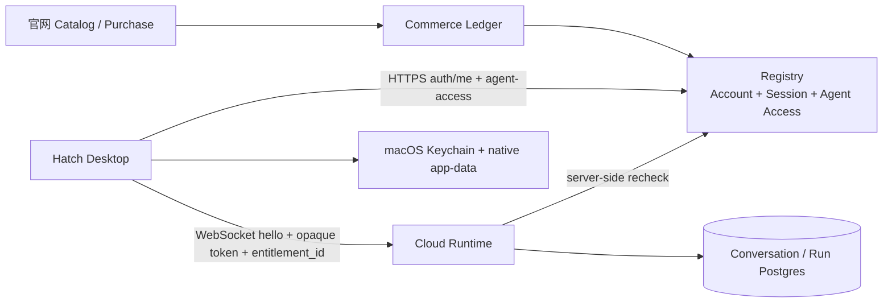

# Hatch Desktop Auth & Agent Access v1

状态：设计已确认，已在独立 worktree 实现并完成 client/native UAT

日期：2026-08-10

范围：Hatch Tauri Desktop、Registry/Auth、Cloud Runtime 与 Agent entitlement 的边界和用户流程。

## 1. 结论先行

这份设计在明确约束下同时满足 desktop + cloud service 的安全基线和 KISS：

1. Desktop 只有两个身份结果：`Signed out` 或 `Signed in`。启动时的检查只是短暂的 launch loading，不是第三种身份。
2. 无 Agent 不是未登录，也不是 error/gate，而是已登录账号的正常 empty state；页面唯一主操作是打开官网浏览 Creator Agents。
3. Desktop 不做 browser login、SSO、OAuth/PKCE 或 embedded web login。V1 使用 Hatch 自己的 HTTPS email/password endpoint；如果未来采用 OAuth/SSO，再切换到 external browser + PKCE。
4. Session token 是 server-managed opaque token：原文只在登录响应中返回一次，Desktop 只放 macOS Keychain；服务器只存 hash，并支持 idle/absolute expiry 和 revoke。
5. Web Storage 不保存 token，也不保存持久化的 Desktop application state。token 进 Keychain，非敏感设置进 Tauri native app-data store。
6. Auth 与 entitlement 完全分离。`/v1/auth/me` 证明是谁，`/v1/user/agent-access` 决定当前能使用哪些 Agent；`[]` 是有效响应。
7. 多个 Agent 时恢复该账号上一次使用的 Agent；没有可恢复的 Agent 时选最新 active Agent；完全没有 Agent 时进入 empty state。
8. Registry 是账号和 access 的权威源。Runtime 在建立 WebSocket、读取 history，
   以及每个 `client.message` 创建 run 之前都重新验证 opaque session 与
   entitlement；Desktop 的判断只负责 UX，不负责授权。
9. 数据库不做大重构：保留 `accounts`、`agent_corpora`、`agent_access` 和 Commerce append-only Ledger，只新增最小的 `account_sessions`，并修正两个现有 access projection bug。

## 2. 为什么当前流程会让用户困惑

当前实现把四件不同的事当成了一件事：

- [main.jsx](../desktop-app/src/renderer/main.jsx) 将 `signedIn` 初始设为 `false`，但同时又恢复 `buyerSession`；因此“本机已有 session”仍然先落到 Sign In screen。
- `signIn()` 会先加载 Agent entitlement，再把账号标成 signed in；`validateAndSaveAuthSession()` 甚至在 Agent 数量为零时抛错。于是“没有购买 Agent”被错误地表现成“无法登录”。
- [auth-session.js](../desktop-app/src/renderer/auth-session.js) 将 raw `accessToken` 写进 `localStorage`，并保留 returning profile、Continue as、Use a different account 等中间 UI。
- [entitlement-client.js](../desktop-app/src/renderer/entitlement-client.js) 先取 access，再取整个 public catalog，Desktop 自己把两者拼成可展示 Agent；这让空状态和网络失败更难区分，也让一次启动需要两次请求。
- [registryAuth.ts](../runtime-server/src/registryAuth.ts) 当前签发 7 天 stateless HMAC token。它没有 server-side revoke，也没有独立的 session 生命周期。
- [registryStore.ts](../runtime-server/src/registryStore.ts) 的 `rowToAccess()` 把数据库中的 `status` 强制改成 `active`，`persistAccess()` 的 conflict update 也没有同步 status/product/granted time。

截图中的“Continue as Preview User”因此同时暴露了身份恢复、preview 注入、entitlement gate 和 token 失败，用户无法知道自己究竟是未登录、没有 Agent，还是服务不可用。

## 3. 产品与系统边界



职责固定如下：

| 组件 | 权威职责 | 不负责什么 |
| --- | --- | --- |
| Website | 浏览、购买、账号帮助 | 不把登录结果直接注入 Desktop |
| Registry | Account、session、Agent catalog、当前 access projection | 不保存 Desktop workspace 或 conversation UI 偏好 |
| Commerce | 订单与 entitlement/revenue 的 append-only audit source | 不作为 Desktop 每次读取的 session store |
| Cloud Runtime | 每次运行的 server-side authz、Agent Corpus、conversation/run | 不信任 Desktop 自报的 user/creator/Agent scope |
| Desktop | 身份 UX、Agent 选择、workspace grant、local tool 执行、渲染 | 不决定用户是否有权使用 Agent |

这与现有 [Pi Cloud Runtime contract](spec-pi-cloud-runtime.md) 的 ownership boundary 一致；本设计只把登录和 Agent 入口简化为可理解的 Desktop flow。

## 4. 用户可见的状态模型

### 4.1 只有两个身份状态

`launching`、`network_error` 和 `offline_banner` 是启动/传输状态，不是第三种身份。用户最终只会看到：

```text
                    ┌──────────────┐
             ┌─────▶│ Signed out   │◀──── invalid/expired session (401)
             │      └──────┬───────┘
             │             │ sign in
             │             ▼
        ┌────┴──────────────────────────┐
        │ Signed in                     │
        │  ├─ active Agents: Library    │
        │  └─ zero Agents: Empty state  │
        └────────────────────────────────┘
```

### 4.2 启动流程

1. Desktop 从 Keychain 读取 active session token。
2. 没有 token：直接显示 `Signed out`。
3. 有 token：显示极短的 launch loading，并请求 `GET /v1/auth/me`。
4. `200`：账号已确认，再请求 `GET /v1/user/agent-access`。
5. `401`：session 已失效或被撤销；删除本机 token，显示 `Signed out`。
6. 网络超时、DNS/TLS 失败或 `5xx`：显示独立的 `Network Error` page，保留本机 token；不能把用户强制变成 signed out。
7. `agent-access` 返回 `200 []`：仍显示 `Signed in`，进入 empty state。
8. `agent-access` 返回一个或多个 active Agent：恢复最近使用的 Agent 并进入正常 Library。

### 4.3 已打开后的网络断开

如果账号和 Agent 已经加载完成，运行期间网络断开只显示 in-context offline banner：

> Connection lost. Your conversation stays here. Retry.

不清空账号、Agent、workspace 或当前消息。WebSocket 按现有 reconnect policy 重试。只有服务明确返回 `401` 才清除 session。

### 4.4 三个核心页面

#### Signed out

```text
Welcome to Hatch
Sign in to use the Creator Agents available to your account.

Email
Password

[ Sign in ]
```

删除以下概念和文案：`Preview User`、`Continue as ...`、`Your agents are ready on this computer`、`Use a different account`。更换账号的动作就是 Sign out 后在同一个 Sign in 页面输入另一个账号。

#### Network Error

```text
Hatch can't reach the service
Check your connection and try again.
Your saved access stays on this computer.

[ Retry ]
```

这不是 error logout，也不删除 Keychain token。

#### Signed in but no Agent

```text
Your Creator Agents
Find an Agent built around a creator's proven method.

[ Browse Creator Agents ]
```

这不是 `Access Required`，也不是“空 Library 错误”。按钮通过 Tauri 的 system-browser API 打开固定 allowlist 中的官网 Catalog URL，例如 `https://hatch.tokenquadrant.cn/agents`。不在 Desktop 内嵌网站，不把任意服务端 URL 交给 `open`。

用户从官网回到 Desktop 后，Window focus/visibility event 触发一次 entitlement refresh；也可以提供一个低优先级 `Refresh`。如果新 Agent 出现，按最近使用规则选择并进入 Library。

## 5. 登录与 session 设计

### 5.1 V1 的明确取舍

V1 不是 OAuth client，而是 Hatch 自己的 first-party account API：Desktop 通过 TLS 将 email/password 发送到 Hatch Registry，Registry 验证密码后签发 Hatch session。

Consumer Desktop 只接受 `role: user`。Creator 凭据本身仍是有效 Hatch
身份，但 Desktop 必须显示明确的 buyer-account 提示，并允许安全退出；
不能把 Creator 的 `agent-access` 角色错误伪装成密码错误、网络错误或
session 失效。

这是针对当前产品约束的最小方案：没有 browser redirect、SSO、PKCE、refresh-token family、cookie jar 或多个 identity provider。密码只在登录请求内存中存在，Desktop 不落盘，也不把它交给第三方。

这不是对 OAuth 的否定。若以后加入 Google/Apple/企业 SSO，必须重开一个 OAuth/OIDC 设计，采用 external browser + Authorization Code + PKCE；native app 不应使用 embedded web-view 登录。[RFC 8252](https://www.rfc-editor.org/info/rfc8252/) 明确要求 native app 的 OAuth authorization 使用 external user-agent。[RFC 9700](https://www.rfc-editor.org/rfc/rfc9700.html) 也将 Resource Owner Password Credentials Grant 列为不可使用。当前方案之所以不违反该结论，是因为它不是 OAuth password grant，而是 Hatch first-party sign-in endpoint。

### 5.2 Session token

- 使用 CSPRNG 生成至少 256-bit 的 opaque token；token 不编码 account、role 或权限。
- Registry 只存 `sha256(token)`（或等价的强 hash），不存 raw token。
- Desktop 只把 raw token 存到 macOS Keychain；Apple 的 Keychain 是系统提供的小型 secret/key 的持久化位置。[Apple Keychain documentation](https://developer.apple.com/documentation/security/storing-keys-in-the-keychain)
- 所有 API 和 WebSocket 使用 `Authorization: Bearer <token>` / `auth_token`；不会使用浏览器 cookie。
- token 不进入 localStorage、Tauri WebView storage、日志、analytics、crash report、conversation、Agent Corpus 或截图。
- token 只用于 Hatch Registry/Runtime allowlisted endpoints。Runtime 不再复制解析 Registry 的 token 签名格式，而是让 Registry 作为唯一 token verifier。

### 5.3 Session 生命周期

V1 默认值：

| 项目 | 默认值 | 行为 |
| --- | --- | --- |
| idle timeout | 30 天 | 30 天没有任何 authenticated request 后失效 |
| absolute timeout | 90 天 | 无论是否活跃，创建后 90 天必须重新登录 |
| renewal | 无独立 refresh token | 每次合法请求更新 `last_seen_at`；不越过 absolute timeout |
| logout | 立即本地清除 + 尝试 server revoke | 网络不可用时仍让本机立即退出；server session 受剩余 TTL 限制 |
| 401 | 清除本机 token并回到 Signed out | 只对明确的 auth failure 执行 |
| network/5xx | 保留 token | 启动显示 Network Error，运行中显示 offline banner |

30/90 天是一个桌面 productivity app 的明确 V1 默认，不是隐藏在客户端的计时逻辑；超时判断必须在 Registry server-side 完成。OWASP 要求 session 同时有 idle 与 absolute timeout，并且由服务器强制执行。[OWASP Session Management](https://cheatsheetseries.owasp.org/cheatsheets/Session_Management_Cheat_Sheet.html)

### 5.4 API 契约

#### `POST /v1/auth/signin`

Request：

```json
{ "email": "user@example.com", "password": "..." }
```

Response：

```json
{
  "account": {
    "id": "user_123",
    "role": "user",
    "email": "user@example.com",
    "display_name": "Jordan Lee"
  },
  "session": {
    "token": "opaque-token-returned-once",
    "expires_at": "2026-11-08T00:00:00.000Z"
  }
}
```

#### `GET /v1/auth/me`

携带 Bearer token，返回 account public profile 和 `session_expires_at`。它只回答“这个 session 代表谁”，不检查是否购买 Agent。

#### `POST /v1/auth/logout`

携带 Bearer token，将对应 `account_sessions.revoked_at` 写入当前时间。Desktop 在请求成功或失败后都删除本机 Keychain item；失败只影响 server revoke 的即时性，不阻塞用户退出。

#### `GET /v1/user/agent-access`

携带 Bearer token，返回该账号当前可用的完整 Agent presentation：

```json
[
  {
    "entitlement_id": "ent_123",
    "user_id": "user_123",
    "creator_id": "maya-chen",
    "agent_id": "signal-resume",
    "product_id": "signal-resume-product",
    "order_id": "order_123",
    "status": "active",
    "granted_at": "2026-08-09T10:00:00.000Z",
    "creator": { "id": "maya-chen", "name": "Maya Chen" },
    "product": {
      "id": "signal-resume-product",
      "name": "Signal Resume",
      "description": "..."
    },
    "presentation": {}
  }
]
```

`200 []` 是合法的“已登录但没有 Agent”。Registry 在服务端把 `agent_access` 与当前 `agent_corpora` presentation 合并；Desktop 不再先拉 access 再拉整个 public catalog。`/v1/catalog/agents` 仍可给官网使用，但不是 Desktop 启动依赖。

Runtime 在 WebSocket 建立、history request，以及每个 `client.message`
创建 run 前继续根据 `entitlement_id` 重新复核当前 opaque session 与
access；不能因为 Desktop 曾经拿到过列表或已经建立 socket 就信任它。
登录后被 revoke 的 session 或 entitlement 必须在下一 turn 产生可行动的
认证/授权错误，并且不能启动 Agent run。

### 5.5 Runtime 的验证边界

当前 Runtime 通过 `verifyHatchAuthToken()` 复制解析 Registry 的 HMAC token。改造后 Registry 是唯一 verifier：

1. Runtime 收到 `client.hello` 的 opaque token。
2. Runtime 通过 Registry `GET /v1/auth/me`（或同语义的内部 auth introspection）得到 `account_id`、`role`、session expiry。
3. Runtime 再用 entitlement resolver 校验 `entitlement_id` 与当前 Agent/Corpus 的 `(creator_id, agent_id, product_id)` 一致。
4. Desktop 自报的 `user_id`、`creator_id`、`agent_id` 不能扩大权限。

这样不需要让 Desktop、Runtime、Registry 共享 signing secret，也不需要在多个服务中维护不同的 token parser。

## 6. Desktop 本地数据结构

### 6.1 Secret storage：macOS Keychain

只有一个 active account session，避免 profile chooser 和多 session UI：

```text
Keychain service: cn.tokenquadrant.hatch.desktop-session.v1
Keychain account: active-session
Keychain value:  opaque session token (raw string)
```

存储模式是**编译期 capability**，不是 renderer 可修改的 setting：

1. `tauri dev`、本地 debug、ad-hoc DMG 与所有临时 UAT 构建没有
   `HATCH_PERSISTENT_SESSION=1`，只使用进程内 token。它们不读、写、迁移或
   删除任何 Login Keychain item；重启后需要重新登录是刻意的安全/UX 取舍。
2. 只有 release CI 同时设置 `HATCH_PERSISTENT_SESSION=1` 和
   `HATCH_APPLE_TEAM_ID`，才会编译出持久化路径。macOS runtime 在每次进程首次
   使用该路径前，通过 Security.framework 验证当前 executable 的**精确 bundle
   identifier、Developer ID Application certificate 与 Team ID**；验证失败则
   fail closed，不触碰 Keychain，也不降级到 Web Storage。
3. 新的 production service 与历史 `dev.hatch.local.desktop-session.v2` 和
   `dev.hatch.local` 隔离。应用启动不自动读取或迁移旧 item，避免多个
   worktree/ad-hoc binary 争用旧 ACL 而每次弹 Login Keychain 密码。升级后的
   用户可能需要重新登录一次；旧 item 的人工清理仅能作为显式 support 操作。

稳定签名 app 首次登录创建 Keychain item 后，后续正常 read/write 应无系统密码
对话框。不能通过宽松 ACL、“所有应用可读”、`security` CLI 或 `localStorage`
解决提示问题。发行包启动时如果 token 存在就自动验证：验证成功进入工作区；
`errSecItemNotFound`、Keychain locked、ACL 不匹配或其他读取失败都回到普通
Sign in，而不是展示独立的 Secure Session recovery 页面。401 会清除失效 token
并回到 Sign in；网络失败则保留 token，显示 Network Error，并允许稍后重试。
清除 token 失败也只在 Sign in 页面内联提示，不能把 renderer 伪装成已退出或
preview identity。

发行验收必须验证实际 `.app`（不是仅验证 DMG）：`codesign -dvvv` 显示预期
`Developer ID Application`、Team ID 和 identifier，hardened runtime/notarization/staple
通过，且在干净用户账号完成登录、退出、重启后的 silent Keychain read/write。

### 6.1.1 Windows persistent session status

当前 Windows 不能声称与 macOS 对等。现有 `keyring` Windows backend 是 Win32
Generic Credential Manager；Microsoft 文档明确 generic credentials 可由同一用户的
processes 读写。Authenticode 只能验证 binary 的发布者/完整性，不能为该 target
name 增加 app-only ACL。因此即使 Windows build 意外带有
`HATCH_PERSISTENT_SESSION=1`，Native bridge 也必须 fail closed；正常 Windows
dev/UAT/当前 release candidate 都保持进程内 session。

要启用 Windows persistent session，必须先作为独立 release capability 交付一个
经过 threat-model 证明的 device-bound/session-challenge backend，并同时完成：

1. 明确证明 app-only 或设备绑定边界；同用户 full-trust 进程的读取/重放负测必须
   失败。MSIX package identity、Authenticode 或 AppContainer runtime gate 本身不足以
   把 PasswordVault/Credential Locker 变成 Hatch-only bearer-token vault；
2. 受信任的 Windows signing CI、package/publisher verification，以及 backend 的
   runtime identity checks；
3. Windows 真机 UAT：新装、登录、重启、退出、更新、损坏/未签名包、不同 user 与
   另一 app 的 credential-access negative test；
4. Tauri 的 workspace picker、file drop、WebView2、shell fail-closed 路径在该
   backend 与打包权限模型下重新验收。

在这些条件满足前，不得通过 Generic Credential Manager、DPAPI-user scope、app-data
文件或 localStorage 来“补齐”自动登录。

### 6.2 Native app-data：非敏感设置

使用 Tauri native app-data store（JSON/SQLite 均可；V1 选已有 Tauri Store 能力或等价单文件），不使用 `localStorage`：

```json
{
  "schema_version": 1,
  "accounts": {
    "user_123": {
      "last_selected_entitlement_id": "ent_123",
      "workspace_grant": {
        "grant_id": "workspace_opaque_native_id",
        "display_path": "/Users/jordan/project"
      },
      "permission_mode": "ask-before-changes",
      "conversation_id_by_entitlement": {
        "ent_123": "conversation_user_123_ent_123"
      }
    }
  }
}
```

说明：

- renderer 只保存 opaque `grant_id` 与展示路径，不保存可由 WebView 伪造为
  授权的 raw root。native grant store 保存 macOS bookmark；启动恢复先做
  bookmark resolve 与真实 `read_dir` 探针，失败就回 onboarding。
- `last_selected_entitlement_id` 只影响默认打开哪个 Agent，不是 authorization。
- conversation history 的权威数据仍在 Cloud Runtime/Postgres；本地只保存恢复所需的非敏感标识。
- 旧 `localStorage` key 绝不迁移 raw token 或 raw Workspace path。升级代码
  只可读取有效的两档 permission policy 与 conversation id，一次性写入
  native store 后删除这些旧 key；旧 Workspace 必须通过原生 folder picker
  重新选择。所有 auth/token/session key 必须删除而不能复制。无法可靠识别
  旧格式时，显示一次性安全 reset 提示，不能静默声称迁移成功。

### 6.3 Agent 选择算法

```text
active = server response filtered to status == active

if settings[account_id].last_selected_entitlement_id is in active:
    selected = that entitlement
else if active is not empty:
    selected = active sorted by granted_at descending, first item
else:
    selected = none; render signed-in empty state

on every explicit selection:
    persist last_selected_entitlement_id immediately
```

这就是“默认上一个”。不会永远打开 `entitlements[0]`，也不会创建 dummy Agent、dummy Workspace 或 dummy chat。

## 7. Database 设计：最小改动

### 7.1 保留的表和权威关系

- `accounts`：账号身份和 password verifier；本模块不拆分成 profile/identity/device 多张表。
- `agent_corpora`：当前已发布 Agent 的 product presentation 和 corpus digest。
- `agent_access`：账号对 Agent 的 operational access projection。
- `packages/commerce` Ledger：订单、grant、delivery、revenue 的 append-only audit source；不改成 Desktop session store。
- Runtime 的 `conversations`、`runs`、messages：继续由 Cloud Runtime/Postgres 管理；登录重构不改变它们。

### 7.2 新增唯一表：`account_sessions`

```sql
CREATE TABLE account_sessions (
  id UUID PRIMARY KEY,
  account_id TEXT NOT NULL REFERENCES accounts(id) ON DELETE CASCADE,
  token_hash TEXT NOT NULL UNIQUE,
  client_type TEXT NOT NULL DEFAULT 'desktop'
    CHECK (client_type = 'desktop'),
  created_at TIMESTAMPTZ NOT NULL,
  last_seen_at TIMESTAMPTZ NOT NULL,
  idle_expires_at TIMESTAMPTZ NOT NULL,
  absolute_expires_at TIMESTAMPTZ NOT NULL,
  revoked_at TIMESTAMPTZ
);

CREATE INDEX account_sessions_account_active_idx
  ON account_sessions(account_id)
  WHERE revoked_at IS NULL;
```

不新增 refresh-token table、device table、login-attempt table、account-profile table。登录限流、审计日志可由 edge/platform telemetry 提供；若以后需要更强审计，再单独扩展，不把本次 KISS 设计变成 IAM 平台。

### 7.3 `agent_access` 的两个必要修正

这不是大重构，但必须在实现时一起修：

1. `rowToAccess()` 应读取并验证数据库的 `status`，不能无条件返回 `"active"`。`revoked`/`disabled` access 必须真正不可用。
2. `persistAccess()` 的 `ON CONFLICT (user_id, creator_id, agent_id)` 至少同步 `status`、`product_id`、`order_id`、`granted_at`；同时保持现有 grant identity 稳定，避免新 `entitlement_id` 在内存与数据库行之间分叉。

`listAgentAccess()` 继续只返回 active grants。没有任何 active grant 返回空数组，不抛异常。

### 7.4 为什么不把 `last_selected_entitlement_id` 放数据库

它是一个 Desktop UX preference，不是跨设备业务事实：

- 不影响授权；
- 不需要在官网或 Runtime 使用；
- 放在 Registry 会引入 device/installation semantics；
- 本机保存更快、更符合 desktop 直觉。

因此它留在 native app-data，不进 Postgres。

## 8. 官网 Browse 与购买后的回流

1. Empty state 的 `Browse Creator Agents` 只打开固定官网 URL；不携带 session token，不尝试把 Desktop 身份传给浏览器。
2. Catalog 浏览可以匿名；购买和网站账号由官网自己处理。
3. V1 假设官网购买使用同一个 Hatch account。没有 SSO/自动 account linking；如果用户在官网购买了另一个账号，Desktop refresh 不会显示该 Agent，这是身份一致性的预期结果。
4. Desktop 获得 focus 后 refresh `/v1/user/agent-access`。
5. 新 Agent 出现后按第 6.3 节选择；没有新 Agent 仍停留在 empty state，不显示 error。

这是“browse on website”，不是“登录 gate”。Desktop 不嵌入支付页，也不需要等待浏览器 callback。

## 9. 安全与 best-practice 判断

在“明确不做 browser login/SSO”的约束下，最终设计的安全基线是：

- first-party HTTPS credential exchange，密码不落盘；
- server-side opaque sessions，可 idle/absolute expire，可 revoke；
- raw secret 使用 macOS Keychain，而不是 Web Storage；
- authn（是谁）和 authz（能用什么）分离；
- Runtime 服务端每次绑定/运行复核 entitlement；
- 外部浏览器只用于公开 Catalog，不用于 Desktop 身份注入；
- 401 与 network/5xx 明确分流，避免把离线用户误登出；
- token 不泄露到 logs、URLs、public catalog 或 conversation；
- Desktop 到 Caddy 的所有身份与 Runtime 流量都使用 TLS。当前单机部署中，
  Caddy、Runtime 与 Registry 之间只通过不对 host 发布端口的专用 Compose
  network 通信；这是明确的同主机 trusted-hop 例外，不应被描述成 mTLS。
  一旦服务跨主机或该 network 不再专用，必须在迁移前启用 TLS/mTLS。
- signup/signin 在应用层使用可信 client IP 的硬请求预算，以及按 route
  分离的 normalized-identity 失败预算；正确凭据可清 identity 失败，但不能
  绕过 IP 预算。key 仅保留 hash、内存有界，超限返回 `429` 与
  `Retry-After`。密码校验对未知账号也执行等价的异步强 hash 工作，并限制
  active/queued KDF 数量，避免明显的 account-enumeration timing oracle 与
  event-loop 阻塞。

这是在当前产品选择下的最小安全设计。若将“符合 native app 的 OAuth best practice”作为未来目标，下一阶段才加入 RFC 8252 的 external browser + PKCE；不会现在为了“看起来标准”而引入用户明确不要的 SSO 流程。

## 10. 实施顺序与落地记录

实现按以下顺序落地：

1. Registry 增加 `account_sessions`、signin/me/logout、opaque token hash/expiry/revoke。
2. Runtime 改为调用 Registry 验证 session，不再复制 HMAC parser；建立
   socket、读取 history 和每个新 turn 都保持 entitlement binding 校验。
3. `agent-access` 返回完整 presentation，空数组为正常结果；修正两处 access projection/upsert bug。
4. Desktop 增加 Keychain/native settings adapter；删除 token 的 localStorage 路径。
5. Desktop 启动 bootstrap：`no token -> Signed out`、`401 -> Signed out`、`network -> Network Error`、`[] -> Empty state`。
6. 删除 returning-profile/Preview/Continue/Use a different account 组件和文案。
7. 增加外部官网 Browse、focus refresh、last-selected Agent 恢复。
8. 旧 build 的 HMAC/localStorage session 仅保留为 local fixture/migration compatibility；生产 Desktop 不再注入 preview identity，旧用户首次升级重新登录。
9. Registry 的 signup/signin 增加有界双维度限流，并让不存在账号的密码
   验证走等价 KDF 路径。

## 11. 验收矩阵

| 场景 | 预期结果 |
| --- | --- |
| 新安装，无 Keychain token | Signed out；无 Preview/默认账号 |
| 有效 token，Registry 在线，0 Agent | Signed in empty state；Browse Creator Agents |
| 有效 token，Registry 在线，1+ Agent | Signed in；恢复上一次 Agent |
| 上一次 Agent 已失效，仍有其他 Agent | 选最新 active Agent，并更新本地偏好 |
| token 过期/被 revoke | 清除本机 token，Signed out |
| 启动时断网 | Network Error page；Retry；token 保留 |
| 已打开后断网 | 当前 signed-in UI 保留；offline banner；可 Retry |
| `agent-access` 返回 `[]` | 不抛异常、不显示 Access Required、不显示空 Library error |
| 点击 Browse | 打开系统浏览器固定官网 URL；不嵌入 WebView，不带 token |
| 从官网返回 | 自动 refresh；新 entitlement 出现即进入 Library |
| Sign out | best-effort server revoke + 立即删除 Keychain；回 Signed out |
| Runtime 收到错误 entitlement | 服务端拒绝；Desktop 不能绕过 |
| session 在 hello 后被 revoke | 下一条消息在 run 创建前拒绝；不调用 Agent |
| entitlement 在 hello 后被 disable/revoke | 下一条消息在 run 创建前拒绝；提示 refresh Agent |
| Creator 账号登录 Consumer Desktop | 身份不被伪装成失败；显示 buyer-account 提示并可安全退出 |
| 同一 IP 或 email 高频 signup/signin | `429` + `Retry-After`；另一维度不可绕过 |

## 12. 已确认的 V1 决策

- 不做 browser login、SSO、OAuth/PKCE。
- 不把“无 Agent”作为身份 gate。
- 不显示 `Access Required` error；无 Agent 是 empty state + 官网 Browse CTA。
- 不使用 Preview User 作为生产 fallback。
- 不保存 raw auth token 到 localStorage。
- 一个安装只保留一个 active account session；切换账号通过 Sign out/sign in。
- 多 Agent 默认恢复上一个。
- 启动断网显示 Network Error page；运行中断网显示 offline banner。
- session 默认 30 天 idle、90 天 absolute；以 server-side 为准。
- Consumer Desktop 只支持 buyer/user role；Creator 使用 Creator Portal。
- Runtime 在每个用户 turn 前重新验证 session 与 entitlement。
- first-party signup/signin 使用 IP 硬预算和分 route 的 identity 失败预算。
- 不重构 Commerce Ledger，不把 Desktop 偏好塞进数据库。

## 13. 实现与验证记录

实现 branch：`codex/desktop-auth-agent-access-v1`（独立 worktree；不修改 `master`）。

已落地的关键边界：

- Registry 新增 `account_sessions`，raw opaque token 只回传给 Desktop；服务端存 SHA-256 hash，按 30 天 idle / 90 天 absolute 过期并支持 revoke。
- Runtime production path 通过 Registry `/v1/auth/me` 验证 opaque session；旧 HMAC 只留给 resolver-free/local fixture path。
- Registry `/v1/user/agent-access` 直接返回 presentation；`200 []` 保持为空状态，revoked/disabled grant 不会出现在结果中。
- Desktop token 在正式稳定签名 macOS 包走 Developer-ID-gated Keychain command；dev/ad-hoc UAT 只走进程内 token，非敏感设置走 Tauri app-data JSON；renderer 不再使用 Web Storage 或 Preview User。
- Desktop 页面只有 Signed out、Signed in（有 Agent / empty state）和传输态 Network Error；Browse CTA 走系统浏览器 allowlist。

验证清单：

- renderer Vitest：25 tests passed。
- Runtime TypeScript build + node tests：96 tests passed。
- Tauri Rust tests：5 tests passed（含外部 Catalog URL allowlist）。
- client UAT（Vite + 本地 Registry）：Signed out、真实 opaque sign-in 后的 signed-in empty state、Browse CTA 可见、Registry 断开后的 signed-in 保留状态与 retry error 均已验证。
- packaged native UAT（Tauri release bundle）：在线时显示真实 signed-in empty state 与 Browse CTA；启动时 Registry 不可达时显示 Network Error page，并提供 Retry。ad-hoc UAT 只保留进程内 session，不读取旧 Keychain item；正式 Developer ID 包另做 silent Keychain persistence UAT。
- `desktop-app npm run build:web`、`git diff --check` 均通过；未修改 `master` worktree。

## 参考标准

- [RFC 8252 — OAuth 2.0 for Native Apps](https://www.rfc-editor.org/info/rfc8252/)
- [RFC 9700 — Best Current Practice for OAuth 2.0 Security](https://www.rfc-editor.org/rfc/rfc9700.html)
- [Apple — Storing Keys in the Keychain](https://developer.apple.com/documentation/security/storing-keys-in-the-keychain)
- [OWASP — Session Management Cheat Sheet](https://cheatsheetseries.owasp.org/cheatsheets/Session_Management_Cheat_Sheet.html)
- [NIST SP 800-63B — Session Management](https://pages.nist.gov/800-63-3/Implementation-Resources/63B/Session/)
