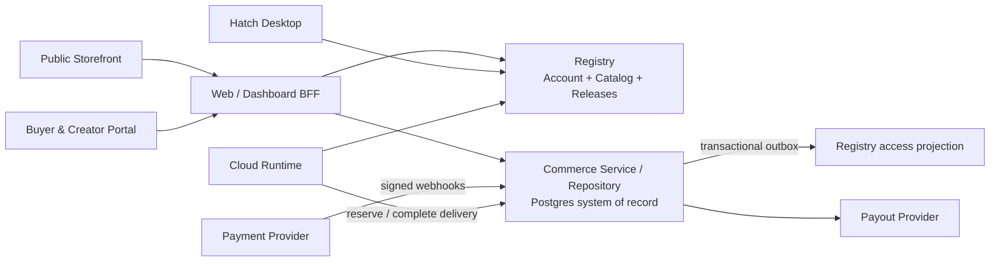

# Hatch Web Dashboard & Commerce Flow v2

状态：Product / UX / Commerce contract draft

日期：2026-08-12

范围：公开 Creator Agent storefront、Web Buyer Portal、Creator Dashboard、Dashboard BFF、Registry catalog/access projection、Commerce、Desktop activation 与 Runtime delivery accounting。

本文不重写 Agent Runtime、Creator-learning 数据策略或 Desktop workspace 权限模型；相关边界继续遵守 [Creator Coactive Learning v1](./spec-creator-coactive-learning-v1.md) 与 [Desktop Auth & Agent Access v1](./spec-desktop-auth-and-agent-access-v1.md)。

## 0. 证据边界

本规格综合了生产 Portal 的只读 UAT、已有 proof screenshots，以及 2026-08-12 当前 working copy 的代码审查。三类证据必须分开理解：

- **生产实测**：只验证既有 UAT 账号可见的登录、Explore、Agent detail、My agents 与 Order history；本轮没有创建订单、触发 refund、运行付费 delivery 或修改生产数据。
- **已有 proof**：购买前、零金额 checkout success 与 entitlement 页面来自仓库已有 UAT 证据，只作为当前交互基线，不代表自动化视觉回归。
- **源码推导 / 本地复现**：共享 JSONL 的跨进程可见性、零金额 delivery revenue 校验、direct grant、Factory 发布断点等结论来自当前未提交 working copy 与本地模块复现；除非另有生产日志，不把它们表述为已在生产发生的事故。

因此，下文的 current-state diagnosis 是 implementation risk；V2 contract 与验收矩阵才是 normative 产品要求。

## 1. 结论先行

V2 只围绕两条 North Star journey 验收：

```text
Buyer
公开可分享商品页
→ 登录 / 注册
→ 真实 offer 与订单确认
→ 支付或免费领取
→ Success / Receipt
→ Open Desktop / Download
→ Order & entitlement detail

Creator
Factory 自动保存
→ Candidate review
→ Approve
→ Offer / 定价
→ Storefront preview
→ Publish
→ Share link
→ 完整 Orders / Delivery
→ Payouts
```

V2 必须同时满足以下结果：

1. 任何 Agent、订单、entitlement、Factory run 和 Creator product 都有可刷新、可返回、可分享或可恢复的真实 URL；页面不再只靠 React 内存状态存在。
2. Public storefront 在登录前可浏览；身份验证发生在表达购买意图之后，并返回原商品或 checkout。
3. 客户端从不提交权威价格、Creator ID、release digest、收入拆分或 entitlement 范围；服务器从已发布 release + active offer 生成不可变订单快照。
4. 免费订单显示 `Free / Access granted`，不伪装成 `Paid`，也不产生零金额 revenue。
5. 付费、授权、交付和收入是不同状态；其中任何后台记账失败都不能把一个已经交付到用户 Workspace 的文件重新表现为“任务失败”。
6. Candidate approval、commercial offer 和 final publication 是三个显式阶段。发布是外部产品副作用，必须由已认证 Creator 最终确认。
7. Commerce 只有一个事务性事实源。Dashboard 与 Runtime 不再各自打开同一个 JSONL 并持有彼此不可见的内存事件。
8. Entitlement 只能由订单、subscription 或显式审计的运营补偿产生；普通用户不能直接调用 grant endpoint 绕过 checkout。
9. 每一笔 entitlement 都绑定明确的 product、offer version、release / Corpus digest、范围、有效期和剩余 delivery units；Runtime 不使用模糊的“当前 Agent”替代已购买版本。
10. V2 launch 先完整支持 `free per-delivery` 与 `paid per-delivery`。Subscription 只有在续费、取消、失败、宽限期、退款和 entitlement 状态全部实现后才可在 UI 中出现。

## 2. 设计原则与非目标

### 2.1 设计原则

- **先承诺，再鉴权。** 用户先看到 Creator、方法、结果、边界和价格，再被要求登录。
- **一个页面，一个可恢复的任务。** URL、标题、主 CTA 和状态必须一致；刷新不会回到默认 tab。
- **一个主 CTA。** 每个页面只突出当前最重要的下一步；次要操作不与主 CTA 竞争。
- **空、慢、错是不同状态。** 未加载不能渲染成 empty；401、403、404、409、422、网络错误和支付失败不能共用一条模糊 notice。
- **价格是服务器快照。** UI 展示的是 active offer，订单保存的是下单时的 immutable offer snapshot。
- **授权先于运行。** Desktop 和 Runtime 每次开始可计费工作前都复核 entitlement，并原子地 reserve delivery unit。
- **交付事实优先。** Delivery 是用户已收到工作结果的事实；revenue、refund 和 payout 是后续财务状态。
- **发布不可变，指针可切换。** 新发布创建 immutable release；rollback 切换 serving pointer，不覆写历史 digest。
- **隐私边界不因 Commerce 改变。** Buyer Workspace、conversation 和原始文件不进入 Creator Dashboard、Commerce 或 Creator-learning 数据。

### 2.2 非目标

V2 不包含：

- 通用 marketplace recommendation、广告位或复杂搜索排名；
- multi-currency settlement、跨境税务引擎或多 merchant-of-record；
- Creator 查看单个 Buyer 的 Workspace、conversation、artifact 内容或受保护 Agent instructions；
- 允许 Creator 手工批准每个 Buyer delivery；
- 在 subscription 生命周期未完成时只做一个静态“subscription”价格标签；
- 用全局 event sourcing 替代产品、订单、entitlement 和 payout 的关系型 read model。Commerce events 是审计与集成边界，不是 UI 每次自行 replay 的唯一查询方式。

## 3. 权威职责



| 组件 | 权威职责 | 明确不负责 |
| --- | --- | --- |
| Public Storefront | 公开 product presentation、active offer、Creator identity、购买入口 | 不决定 entitlement；不接受客户端金额 |
| Web / Dashboard BFF | Browser session、页面聚合、CSRF/return-to、面向 UI 的错误映射 | 不持有独立 Commerce Ledger；不自行 grant access |
| Registry | Account/session、Creator ownership、catalog identity、immutable releases、current serving pointer | 不创建或决定 active price；不创建订单、支付、退款、revenue 或 payout |
| Commerce | Versioned offer/price、Checkout、order、payment、entitlement、delivery unit、delivery accounting、revenue、refund、payout read models 与 audit events | 不读取 Buyer Workspace；不保存 Creator protected Corpus 内容 |
| Registry access projection | 为 Desktop/Runtime 提供低延迟 active entitlement projection | 不是 entitlement 的第二权威源；不能接受普通用户 direct grant |
| Runtime | Server-side entitlement recheck、Agent execution、delivery事实提交 | 不计算当前价格；不因 revenue/payout 异常否定已完成交付 |
| Desktop | 登录、Agent 选择、Workspace 权限、local tools、artifact UX | 不决定授权或价格；不携带 Web session |
| Payment/Payout provider | 支付工具、资金状态和 provider reference | 不决定 Hatch product/release/entitlement 语义 |

V2 的 normative 决策是：Commerce 使用 Postgres 作为单一事务性事实源，并通过一个 logical writer API/repository 执行所有 mutation。Dashboard、Runtime 和 worker 都是客户端；任何进程都不能再把共享 JSONL 文件当成跨进程数据库。

## 4. Information architecture 与真实路由

### 4.1 Public 与 Auth

| Route | Audience | 页面任务 | Primary CTA |
| --- | --- | --- | --- |
| `/agents` | anonymous / signed-in | 浏览已发布 Creator Agents | `View details` |
| `/agents/:creatorSlug/:productSlug` | anonymous / signed-in | 理解一个 Agent 的价值、边界、要求和 offer | `Get for free` / `Buy for …`；subscription CTA 延后到 Phase 3 |
| `/sign-in?returnTo=…` | anonymous | 登录并回到原任务 | `Sign in` |
| `/sign-up?returnTo=…` | anonymous | 创建 Buyer account 并回到原任务 | `Create account` |
| `/account/help` | all | 密码、session 与账号帮助 | 情境化 |

规则：

- Public product URL 是 canonical share URL；Creator 分享的不是 `/portal/` 首页。
- `returnTo` 只允许站内 allowlisted path，不接受完整外部 URL。
- Product page 的 title、description、Open Graph metadata 和 unavailable 状态可在未执行 Buyer JavaScript 前确定；若暂不做 SSR，至少由服务器为 route 返回 canonical metadata。
- Signed-in user 已拥有该 Agent 时，主 CTA 变为 `View your access`，次 CTA 为 `Open Hatch Desktop`。
- Creator 登录后访问自己的 public product，页面增加低优先级 `Manage product`，不替换 Buyer 视角。

### 4.2 Buyer Portal

| Route | 页面任务 | Primary CTA |
| --- | --- | --- |
| `/portal/library` | 查看 active / pending / consumed entitlement | `Open Hatch Desktop` 或 `View access` |
| `/portal/library/:entitlementId` | 查看 entitlement 范围、release、剩余 units、有效期与使用方式 | `Open Hatch Desktop` |
| `/portal/checkout/:checkoutSessionId` | 确认 immutable offer snapshot、条款和支付状态 | `Add to my account` / `Pay …` |
| `/portal/orders` | 查看完整订单历史 | `View order` |
| `/portal/orders/:orderId` | Receipt、payment、entitlement、delivery 与 refund timeline | 依状态变化 |
| `/portal/orders/:orderId/success` | authoritative purchase success 与激活下一步 | `Open Hatch Desktop` |
| `/portal/subscriptions` | 查看 active / past-due / cancelled subscription | `Manage subscription` |
| `/portal/settings` | Account、session、sign out | 情境化 |

`/portal/orders/:orderId/success` 可刷新，也可稍后从 order detail 再次进入。它不是一次性 toast。

### 4.3 Creator Dashboard

Creator primary navigation 保持 `Home`、`Products`、`Orders`、`Payouts`。Factory 是创建/改进一个 product 的工作流，不再作为与 product 脱节的孤立经营栏目。

| Route | 页面任务 | Primary CTA |
| --- | --- | --- |
| `/portal/creator` | 当前 products、待处理 candidate、orders、delivery 与 payout 摘要 | 状态化 `Continue …` |
| `/portal/creator/products` | 全部 product 与 release 状态 | `Create product` |
| `/portal/creator/products/new/factory` | 定义第一个 Task 与 authorized sources | `Start distillation` |
| `/portal/creator/products/:productId` | Product overview 与当前 release health | `Continue setup` / `View storefront` |
| `/portal/creator/products/:productId/factory/:runId` | Factory progress、Creator questions、autosave 与 retry | 状态化 |
| `/portal/creator/products/:productId/candidates/:candidateId` | Candidate report、行为 diff、gates 与 review | `Approve candidate` |
| `/portal/creator/products/:productId/offer` | Offer model、金额、currency、unit、policy | `Save offer` |
| `/portal/creator/products/:productId/preview` | 精确预览 public storefront + active candidate + offer | `Publish` |
| `/portal/creator/products/:productId/releases/:releaseId` | Immutable release、digest、lineage 与 rollback | `Make current`（仅旧 release） |
| `/portal/creator/orders` | 完整 orders、delivery/revenue 状态与 filters | `View order` |
| `/portal/creator/orders/:orderId` | 不含 Buyer private content 的 commerce timeline | 情境化 |
| `/portal/creator/payouts` | Available、pending、in-transit、paid、adjustments | `Connect payouts` / `View payout` |
| `/portal/creator/settings/payouts` | Payout onboarding 与 provider status | `Continue setup` |

Product detail 继续采用既有五个 tab：`Overview`、`Test & improve`、`Examples`、`Versions`、`Data controls`。Candidate review 位于 `Versions`；initial Factory 从 `Create product` 进入，避免一个与产品无关的 top-level Factory inbox。

### 4.4 URL、Back、Refresh 与 Tab 规则

1. 每个表中 route 都必须由 router 解析；不能只用 `setView("detail")` 或 `setActive("Orders")`。
2. Browser Back 返回实际来源。Library detail 返回 Library；public product 返回 catalog 或外部 referrer；不能硬编码 `Back to Explore`。
3. Refresh 恢复 route 与 authoritative server state。只允许丢弃尚未保存且已明确提示的本地临时内容。
4. Product tabs 使用 path segment 或 validated query param；复制 URL 后必须恢复同一个 tab。
5. Modal/drawer 只有在它不是独立任务时使用。Candidate review、checkout、order detail 和 entitlement detail必须有 route；可以用 route-backed modal 呈现。
6. 404 表示资源不存在；403 表示账号无权查看；已下架但曾购买的 product 仍能从 receipt 查看 purchase snapshot。
7. 页面 title 至少包含 product/order context，例如 `Signal Resume Review · Order · Hatch`。

## 5. Buyer journey specification

### 5.1 Public catalog

Catalog card 最少显示：

- Creator name 与 verified identity（若有）；
- product name、promise、适用任务；
- current offer：`Free`、`$39 per delivery` 或 `$19 / month`；
- 已拥有状态；
- `View details`，而不是直接在 card 上执行不可逆 purchase。

Catalog initial state 使用 skeleton。只有 authoritative `200 []` 才显示 empty；network/5xx 显示 Retry，不能显示 `No Agents are published yet`。

V2 launch 不要求 marketplace 搜索，但 route 和 card schema 不应假设 catalog 永远只有两个 Agent。

### 5.2 Public product detail

页面按转化决策顺序展示：

1. Creator identity、product name、promise、offer 与主 CTA；
2. `What you provide`：用户需要准备的输入和 Workspace 要求；
3. `What you receive`：可交付 artifact、典型时长或 delivery unit；
4. `How it works`：购买/领取 → Desktop → Workspace → approval → delivery；
5. Product boundaries：明确不能做什么，不承诺什么；
6. Privacy / local context：哪些数据留在本地，哪些请求发送到 cloud Runtime；
7. Representative examples、evaluation evidence 或 Creator proof；不得显示 protected prompt；
8. Offer details、refund/cancellation policy、subscription renewal（若适用）；
9. Desktop/system requirements 与 FAQ。

主 CTA 由 server response 决定：

| 状态 | CTA | 行为 |
| --- | --- | --- |
| anonymous + free | `Get for free` | sign-in/sign-up，returnTo product，再创建 checkout session |
| anonymous + paid | `Buy for $…` | sign-in/sign-up，returnTo product，再创建 checkout session |
| signed-in + not owned | 同上 | `POST /checkout-sessions` 后进入 route |
| entitlement pending | `Setting up access…` | disabled + live status；可进入 order detail |
| entitlement active | `Open Hatch Desktop` | allowlisted deep link；不携带 Web token |
| Desktop 未安装 | `Download Hatch Desktop` | 官方 release page；保留 entitlement |
| consumed / expired | `Purchase another delivery` / `Renew` | 新 checkout session；不是复用旧 order |
| unavailable | 无购买 CTA | 说明下架；已有 Buyer 仍可看 receipt/access policy |

### 5.3 Sign in / Sign up

- 文案必须 role-neutral：`Sign in to Hatch`，不能只写 `For expert creators`。
- Product summary 与价格在 auth 页面保留，用户知道登录是为了完成哪一步。
- 成功后回到原 product 或已有 checkout，不回默认 Explore。
- `401` 清除无效 browser session 并回 Sign in；network/5xx 保留 session intent，显示 retry。
- Browser session 应由 BFF 使用 `HttpOnly; Secure; SameSite=Lax` cookie 管理。Desktop 继续使用独立 opaque bearer token；两种客户端 session 不互相复制。
- Sign up 后需要的 email verification、年龄/地区或条款同意必须在 checkout 前完成，并可从原任务继续。

### 5.4 Checkout session 与 order review

Buyer 点击 product CTA 时，BFF 请求 Commerce 创建 checkout session。Client 只提交 `product_id` 和选定 `offer_id`；服务器自行解析：

- authenticated buyer；
- active immutable release + Corpus digest；
- active offer version；
- amount minor、currency、unit 与 billing model；
- Creator / Hatch split policy version；
- refund/cancellation policy version；
- session expiry。

Checkout page 显示 snapshot，而不是重新从 mutable catalog 拼接价格。必须显示：

- product、Creator、release label；
- quantity / delivery units；
- subtotal、discount、tax、total（未实现税时不能伪装为已计算）；
- entitlement scope；
- payment method 或 `No payment required`；
- terms/refund policy；
- final CTA。

Offer 在 checkout session 创建后变化时，旧 session 不自动换价。若过期，服务器返回 `409 offer_changed`，页面展示新旧差异并要求重新确认。

#### Free checkout

- CTA：`Add to my account`，不使用 `Purchase Agent` 制造收费预期。
- Order amount 为 `0`，payment status 为 `not_required`，UI 不显示 `Paid`。
- `order + entitlement + audit/outbox` 在一个 transaction 中完成。
- 不创建 `revenue.recognized`，也不创建伪 payment ID。

#### Paid checkout

- CTA 显示精确 total，例如 `Pay $39.00`。
- Payment provider redirect/confirmation 只是支付动作，不是 Hatch success 的权威证据。
- Provider webhook 以 provider event ID 幂等处理；`payment succeeded + order paid + entitlement active + outbox` 在一个 Commerce transaction 中提交。
- Browser return page轮询/读取 order；在 webhook 未完成时显示 `Confirming payment…`，不能提前显示 access granted。
- Decline、cancel、timeout 和 requires-action 在 checkout 内恢复，不产生 active entitlement。

### 5.5 Success / Receipt

成功页必须是可恢复 route，并包含：

```text
Signal Resume Review is ready
Order #HCH-… · Free / $39.00 · Access granted

[ Open Hatch Desktop ]
[ Download Hatch Desktop ]

What happens next
1. Sign in to Desktop with this account
2. Choose this Agent and a Workspace
3. Review local permissions before changes

[ View order and access details ]
```

规则：

- Success 只在 authoritative order + entitlement state 已确认后显示。
- 不把“checkout mutation 已成功但 refetch 失败”改写成“购买失败”。此时显示 `Purchase completed; details are temporarily unavailable` + Retry。
- `Open Hatch Desktop` 使用 allowlisted `hatch://` deep link，只包含 product/entitlement navigation hint，不包含 bearer token、email 或 Workspace path。
- Web 不能可靠检测 Desktop 是否安装，因此始终提供 Download 作为次 CTA。
- 页面触发的 analytics 不含 payment credential、Buyer files 或 token。

### 5.6 Library 与 entitlement detail

Library card 不再只有 `Available`：

- active per-delivery：显示 `1 delivery available`；
- reserved：显示 `In progress` 与安全返回任务的入口；
- consumed：移入 Past access 或显示 `Purchase another delivery`；
- subscription：显示 renew date / past due / cancelled-at-period-end；
- suspended/revoked：说明原因类别和可用恢复动作。

Entitlement detail 显示：

- product、Creator、order link；
- release/version 与 upgrade policy；
- status、remaining units、granted/expires time；
- Desktop activation actions；
- delivery history，仅元数据与 artifact type，不把 Workspace 内容上传到 Web；
- refund/cancellation status 与 support reference。

从 Library 打开 detail 时 Back 返回 Library，sidebar 保持 Library active。

### 5.7 Orders、refund 与 subscription

Buyer Orders 必须使用完整 endpoint 并支持分页，不与 Creator `recent_orders` 共用截断 projection。Order detail timeline 包含：

```text
Order created
Payment not required / Payment succeeded
Access granted
Delivery reserved / completed / released
Refund requested / completed（若有）
```

金额与状态分别显示；`Free` 是金额，`Access granted` 是授权状态，两者不能组合成 `Free / Paid`。

Refund policy 由 active offer snapshot 决定：

- 未 reserve / 未 delivery：通常可 revoke entitlement 并全额退款；
- reserved：先取消或释放 reservation，再按 policy 处理；
- completed delivery：可由 policy 决定不退款、部分退款或人工审核；已落在 Buyer Workspace 的文件不会被远程删除；
- refund 完成后必须同步 entitlement、revenue reversal 和 payout adjustment，不能只修改 order projection。

Subscription UI 只有在以下状态都实现后才可开启：`trialing`、`active`、`past_due`、`grace_period`、`cancel_at_period_end`、`cancelled`、`expired`。每个状态都必须有明确的 access 行为和 Buyer CTA。

## 6. Creator journey specification

### 6.1 Home

Home 按“下一步”而不是只按第一件 product 排序：

1. 需要回答问题或 autosave 失败的 Factory run；
2. Ready for review 的 candidate；
3. Approved 但未配置 offer / preview 的 product；
4. Publish failed 或 payout setup incomplete；
5. Live products、orders、delivery 和 earnings summary。

每个卡片只有一个 `Continue …` CTA，并链接到准确 route。Home 可以显示 `Recent orders`，但 `Orders` 页面必须请求完整数据。

### 6.2 Create product 与 Factory autosave

初始流程：

```text
Define one Task
→ Add authorized sources
→ Validate scope and source authority
→ Start distillation
→ queued / running
→ answer Creator questions
→ compile and evaluate
→ Candidate ready for review
```

Autosave contract：

- Task name、promise、sources metadata 和 Creator answers 在 server draft 中版本化保存。
- 输入变更后 800–1500ms debounce；blur 和 navigation 前立即 flush。
- 页面持续显示 `Saving…`、`Saved at …` 或 `Couldn't save`；使用 `aria-live="polite"`。
- 正常 navigation 不弹确认；只有存在 server 未确认且本地仍有未保存变化时才阻止离开。
- Refresh 读取最新 server draft。浏览器本地只保存非敏感 recovery draft；raw private source 不进入 localStorage。
- Autosave mutation 使用 draft version / ETag；`409 stale_version` 显示可理解的 conflict recovery，不静默覆盖另一 tab。
- 删除 source、提交答案和 `Start distillation` 是显式 mutation，不能被 debounce 隐式触发。
- 长 source 上传有 progress、cancel 和 retry；超过限制时在选择文件后立即提示，不等 final submit。

Factory status 与 CTA：

| Status | UI | Primary CTA |
| --- | --- | --- |
| `draft` | 可编辑，autosave | `Start distillation` |
| `queued` | queue status + safe leave | 无；`View details` |
| `running` | current stage、last update | 无；`Leave running` |
| `waiting_for_creator` | pending questions 与保存状态 | `Submit answers` |
| `needs_attention` | failed stage、safe retryability | `Retry stage` 或 `Edit sources` |
| `ready_for_review` | candidate summary | `Review candidate` |
| `cancelled` | immutable history | `Start new run` |

### 6.3 Candidate review

Candidate review 必须展示：

- exact base release、candidate digest、dataset/eval set、Factory/provider/model version 与 build time；
- deterministic gates；
- held-out sample count与 failed critical cases；
- blinded current/candidate comparison；
- material behavior changes；
- product boundaries；
- known non-critical losses；
- protected instructions 不显示，只显示可理解的行为证据。

CTA：

- critical gate 失败：`Approve` disabled，并解释阻塞项；
- non-critical loss：Creator 必须逐项 acknowledge；
- `Reject candidate` 归档 candidate，不修改 current release；
- `Approve candidate` 记录 authenticated approval，绑定 candidate digest 与 report digest；
- candidate bytes、eval report 或 boundaries 发生任何变化时，旧 approval 失效；
- approval 不自动发布，也不自动沿用到未来 candidate。

### 6.4 Offer / pricing

Approved candidate 进入 commercial setup。Offer 是独立 versioned entity，不直接写回 immutable Corpus bytes；published release 记录当时激活的 offer version。

Offer schema 覆盖下列模式；V2 launch 只激活前两行，subscription 延后到 Phase 3：

| Model | Required fields | Entitlement semantics |
| --- | --- | --- |
| `per_delivery` + amount `0` | currency、unit、included units | 一个 free order 获得明确数量的 delivery units；完成后 consumed |
| `per_delivery` + amount `>0` | amount、currency、unit、refund policy | 每次 checkout 创建新 order/units；不可按 buyer+product 永久去重 |
| `subscription`（Phase 3） | amount、currency、interval、included units/unlimited policy | 仅在完整 lifecycle 实现后开放 |

Offer editor 同时显示 Buyer-facing preview。校验：

- amount 使用 minor integer，UI 使用 locale-aware formatter；
- currency 和 unit 不从历史订单反推；
- Creator/Hatch split 与 reserve policy 明确，但 Creator不能编辑平台 policy；
- price、unit、refund 或 renewal change 创建新 offer version；旧 order 保留旧 snapshot；
- active paid offer 改价需要重新 preview + final publish/activate confirmation；
- 不允许 UI 展示一个 checkout 不支持的 model。

### 6.5 Storefront preview

Preview 使用与 public product page 相同组件和 client-safe payload，并固定到：

- approved candidate digest；
- proposed offer version；
- Creator public profile；
- promise、inputs、outputs、boundaries、privacy copy；
- Desktop requirements；
- refund/subscription policy。

Preview 顶部显示 `Not public`，购买 CTA 禁用并改为 `Preview checkout`。Creator 可以在 desktop/mobile viewport 间切换；这不是另外一套 mock HTML。

Publish readiness checklist：

- candidate approval current；
- no critical gates；
- offer valid且 checkout 支持；
- public copy / boundaries complete；
- Creator ownership valid；
- payout setup：free offer 可不阻塞，paid offer 的阻塞策略必须明确；
- Registry materialization ready；
- canonical slug available。

### 6.6 Publish、share 与 rollback

`Publish` 是 explicit external side effect。Final confirmation 显示 product、candidate version/digest、offer、public URL 和不可变性说明。

Publish transaction / saga 必须满足：

1. 创建 immutable release；
2. 验证/materialize Corpus；
3. 激活 release + offer pair；
4. 原子切换 public current pointer，或在任何失败时保持旧 pointer；
5. 写 authenticated approval/publication audit；
6. 返回 canonical share URL。

Success 页面：

```text
Your product is live
https://hatch.tokenquadrant.cn/agents/maya-chen/signal-resume-review

[ Copy link ] [ View storefront ]
```

Rollback：

- 只允许切换到仍可 materialize、通过 required gates 的旧 immutable release；
- rollback 创建新 audit event，不删除失败 release；
- 历史 order/entitlement 继续引用购买时 release policy；
- rollback 不自动回滚 offer，除非 Creator明确选择并 preview 对应 offer version；
- 当前 checkout session 不静默换 release；过期后要求重新确认。

### 6.7 Orders、Delivery 与 Payouts

Creator Orders 是 aggregate commerce surface，不暴露 Buyer private work：

- order reference、Buyer display name（按 privacy policy最小化）、product、offer snapshot；
- order/payment/entitlement status；
- delivery metadata：started/completed time、artifact type、状态；
- revenue recognized / pending / reversed；
- refund status；
- 不显示 Workspace path、conversation、file content、tool arguments或 raw artifact。

支持 server pagination 与 filters：product、order status、delivery status、date、refund。完整页面调用完整 orders endpoint，不复用 `overview.recent_orders.slice(0, 5)`。

Payout balance 定义：

```text
pending     = 已支付但尚未达到 recognition / reserve policy
available   = 已 recognized - refunds - adjustments - reserves - 已安排 payout
in_transit  = provider 已受理
paid        = provider 已确认到账
```

UI 不得把累计 `creator_share_minor` 直接命名为 `Available balance`。每个 order 使用下单时的 split policy version；平台费率变化不重算历史订单。

## 7. Cross-surface interaction states

### 7.1 Remote data state

每个 route 明确区分：

| State | 表现 | 允许动作 |
| --- | --- | --- |
| `initial_loading` | layout-preserving skeleton；`aria-busy` | 可 Back / Cancel |
| `refreshing` | 保留旧数据 + subtle progress | 可继续读，不重复 mutation |
| `ready` | authoritative content | 正常 |
| `empty` | 只有 `200 []` / domain empty 才出现 | 提供下一步 CTA |
| `recoverable_error` | 原位说明 + Retry | 保留 route/context |
| `auth_error` | Sign in + returnTo | 不显示假 empty |
| `forbidden` | 权限说明 | 回安全页面 |
| `not_found` | 资源不存在/已移除 | Catalog / support |
| `conflict` | 显示变化并要求刷新/确认 | 不静默覆盖 |
| `mutation_pending` | CTA `aria-busy`，防重复提交 | Cancel 仅在 domain允许时 |
| `mutation_succeeded` | durable success route/status | 明确下一步 |

### 7.2 Error mapping

- `400/422`：字段附近 validation；保留输入。
- `401`：清 browser session，跳 Sign in with returnTo。
- `403`：说明角色/ownership不匹配；不反复登录。
- `404`：资源不存在或不再公开；历史 owner/Buyer 可通过受保护 route 看 snapshot。
- `409`：offer、draft、candidate 或 release version stale；显示差异并重新确认。
- `429`：保留任务，显示 retry-after。
- `5xx/network/timeout`：保留 auth intent 和页面数据，提供 Retry；不渲染 empty。
- Payment provider failure：映射为 decline/cancel/requires_action/temporarily_unavailable，不暴露 raw provider error。

所有 mutation 都需要 domain-specific error code，不以 JSON parse error 或 `Request failed with 500` 作为最终文案。

### 7.3 Responsive 与 accessibility

- 验收 viewport：320、390、768、1280 和 low-height desktop。
- Mobile 保留 account menu 与 Sign out；不能隐藏唯一登出入口。
- Buyer 两项 nav 使用内容自适应布局，不固定 `repeat(5, 1fr)`。
- Touch target 至少 44×44 CSS px；sticky CTA 不遮挡内容或系统 safe area。
- 所有 route 有唯一 `h1`、landmark 和跳转主内容入口。
- Active navigation 使用 `aria-current="page"`；动态 save/purchase/publish progress 使用合适的 `aria-live`。
- Keyboard focus 在 route change 后进入 `h1`，modal/drawer close 后返回触发元素。
- 不用 disabled CTA 代替导航；已拥有 Agent 时按钮应可 `Open Desktop` 或 `View access`。
- 状态不只靠颜色；金额、delivery、refund 和 payout 都有文字标签。
- 尊重 `prefers-reduced-motion`，progress animation 有静态替代。
- Factory inputs 必须有可见 `:focus-visible`；错误与 label 使用 programmatic association。

## 8. Commerce domain contract

### 8.1 Offer revision

`OfferRevision` 是 Commerce-owned、versioned commercial contract。Registry 中现有 `product.offer` 只可作为迁移种子；运行期 checkout 不再直接信任可变 Corpus metadata。

最小字段：

```text
offer_id
revision
creator_id
agent_id
product_id
purchase_model: per_delivery | subscription
amount_minor
currency
unit
included_units
billing_interval?          # subscription only
refund_policy_version
split_policy_version
version_policy
status: draft | active | retired
active_from
active_until?
```

规则：

- `amount_minor === 0` 是 free price；`purchase_model` 仍描述 entitlement 范围，不把 `free` 混成 billing lifecycle。
- 缺少 active offer 表示 `not_for_sale`，绝不能默认成免费。
- V2 launch 的 `per_delivery` 必须有 `unit` 与正整数 `included_units`。
- Subscription fields 不完整时 offer 不能 active，也不能出现在 Buyer UI。
- Checkout 固定引用 `offer_id + revision`；Order 保存完整 offer snapshot。
- 调价创建新 revision；旧 order、receipt、revenue 和 refund 继续使用旧 snapshot。
- Creator/Hatch split 使用 versioned policy；Creator UI 可以解释但不能修改平台 policy。

### 8.2 Checkout session

Checkout session 是短期、server-authoritative quote：

```text
checkout_session_id
buyer_id
product_id
release_id
corpus_digest
offer_id + offer_revision
money breakdown
entitlement scope
policy versions
status: open | confirming | completed | expired | cancelled
expires_at
```

Session 本身不是 Order。打开 checkout route 没有财务或授权副作用；只有 final confirm command 才创建/确认 order。

### 8.3 Order 与 Payment

Order、Payment 和 Entitlement 必须分别查询和展示。

Order 状态：

```text
created
fulfillment_pending
fulfilled
cancelled
refund_pending
partially_refunded
refunded
failed
```

Payment 状态：

```text
not_required
requires_action
processing
succeeded
failed
cancelled
partially_refunded
refunded
disputed
```

规则：

- Free order 使用 `payment_status=not_required`，不创建 `pay_zero_*`。
- Paid order 只有在可信 provider webhook/capture 后才是 `succeeded`。
- Order `fulfilled` 表示 commercial entitlement 已授予，不代表 Buyer 已经完成一次 Runtime delivery。
- `payment succeeded + entitlement pending` 是合法、可恢复的 `fulfillment_pending`，不是 purchase failed。
- Order snapshot 保存 Buyer/Creator/product display fields、offer/release、金额、currency、tax/discount、policy versions。
- 一个 Buyer 可以合法重复购买同一 per-delivery product；不能用 buyer+product 作为永久唯一键。

### 8.4 Entitlement 与 Delivery reservation

Entitlement 是 Commerce authority；Registry access 是由 Commerce outbox 同步的 projection。

```text
entitlement_id
buyer_id
order_line_id
creator_id
agent_id
product_id
purchased_release_id
purchased_corpus_digest
effective_corpus_digest
version_policy
valid_from
valid_until?
granted_units
remaining_units
status: pending | active | suspended | consumed | revoked | expired
```

对 per-delivery entitlement，Runtime 开始 chargeable run 前必须调用 `authorize-and-reserve`。Reservation 是独立资源：

```text
reservation_id
entitlement_id
conversation_id
run_id
reserved_units
effective_corpus_digest
status: reserved | consumed | released | expired
expires_at
```

规则：

- Reserve 使用数据库 row lock / atomic conditional update，防止两个并发 run 消费同一个 unit。
- Run 成功交付：delivery 与 reservation consume 在同一 transaction 中提交。
- Run 在交付前失败、取消或超时：release reservation；Buyer 可再次使用该 unit。
- Reservation 超时由 reconciler 释放，并记录 reason；不能永久占用。
- Runtime 每次授权都直接读取 Commerce authority；不能只信任可能延迟的 Registry projection。
- Creator preview 使用独立 `preview_grant`，它不是 Buyer entitlement、order 或 revenue 来源。

### 8.5 Delivery 与 Revenue

Delivery 状态：

```text
started
artifact_ready
completed
failed
cancelled
voided
```

Revenue 状态：

```text
pending
recognized
reversed
```

每个 Delivery 至少记录：

```text
delivery_id
reservation_id
run_id
order_line_id
entitlement_id
purchased_corpus_digest
effective_corpus_digest
artifact_type
artifact_digest
completed_at
```

Artifact 正文、Workspace path、conversation 和 tool arguments 不进入 Commerce。

交付顺序：

1. Runtime 在本地/云端确认 artifact 已完成；
2. Commerce transaction 幂等写入 `delivery.completed` 并 consume reservation；
3. 同一 transaction 写 transactional outbox；
4. Revenue worker 对 paid delivery 按 `delivery_id + rule_version` recognition；free delivery 只记录 zero-value delivery，不创建 revenue；
5. Creator Dashboard 在 recognition 前可显示 `Revenue pending`。

Revenue failure 不能回滚已经确认的 Delivery，也不能让 Runtime 发送 `turn.failed`。若 Commerce 在 artifact 写入后暂时不可用，Runtime 把 accounting command 写入自己的 durable outbox，向 Buyer 显示 `Completed and saved; syncing receipt`，并由 reconciler 重试。

一个 order 可以包含多个 units 和 deliveries；Revenue uniqueness 以 recognition source 为边界，不以 `order_id` 限制只能认收一次。

### 8.6 Refund 与 entitlement consequence

Refund 状态：

```text
requested
provider_pending
succeeded
failed
cancelled
```

Refund command 必须包含 order、金额、reason、actor 与 idempotency key。Provider 确认后，Commerce 在同一 transaction 中提交：

- refund success；
- order/payment adjustment；
- 未使用 entitlement 的 revoke 或 unit adjustment；
- revenue reversal（若已 recognized）；
- payout adjustment；
- outbox/audit。

Commerce authority 已退款后，Runtime 必须立即 deny；不能等待 Registry access projection 更新。已交付到 Buyer Workspace 的 artifact 不被远程删除。

### 8.7 Payout

Payout account 状态：

```text
not_connected
onboarding_incomplete
under_review
active
restricted
```

Payout 状态：

```text
reserved
submitted
in_transit
paid
failed
reversed
```

Balance 由 Commerce ledger projection 计算：

```text
pending   = paid commerce still awaiting recognition / reserve policy
available = recognized earnings - reversals - reserves - submitted payouts
in_transit = submitted provider payouts not yet paid
paid      = provider-confirmed payouts
```

创建 payout 时先 atomically reserve balance；provider 失败时 release。所有金额按 Creator + currency 分账。前端不得自行用 `gross × 90%` 生成权威余额。

### 8.8 Corpus version policy

Order 与 entitlement 必须保存购买时 `release_id + corpus_digest`。支持两种显式 policy：

| Policy | 行为 |
| --- | --- |
| `pinned` | 每次 delivery 使用购买时 release；Registry 必须保留可 materialize 历史 Corpus |
| `track_current_compatible` | 仅在发布声明 backward-compatible 时升级；记录 from/to digest；breaking change 需新购买或 Buyer 明示同意 |

每次 delivery 同时记录 purchased 与 effective digest。Runtime 不得总是解析当前 Catalog release 后再强迫其等于旧 order digest。

Default 为 `pinned`。Subscription 是否使用 compatible tracking 是 offer-level 明示策略，不是隐藏平台行为。

## 9. Transaction、Saga、Idempotency 与 Reconciliation

### 9.1 Free checkout transaction

单一 Commerce transaction：

```text
validate checkout session + active offer/release
create order(amount=0)
set payment=not_required
grant entitlement/units
set order=fulfilled
write audit + outbox
```

任一步失败整体回滚。Response 丢失后，相同 idempotency key 返回已有 order/entitlement。

### 9.2 Paid checkout saga

1. Transaction 创建 order + payment intent reference + outbox。
2. Payment provider 完成 action/capture。
3. Signed webhook 写 durable inbox，并按 provider event ID 去重。
4. Transaction 写 payment succeeded + entitlement grant + order fulfilled + outbox。
5. Fulfillment 超过 SLA 仍未完成时，reconciler 重试；无法修复则自动退款并生成补偿 audit。

Browser redirect 不能直接标记 paid；只显示 `Confirming payment…` 并读取 Commerce authority。

### 9.3 Idempotency contract

所有 mutation 使用 durable `Idempotency-Key` 与数据库唯一约束：

| Command / event | Identity |
| --- | --- |
| Create checkout session | buyer + client request UUID |
| Confirm checkout | checkout session + confirmation UUID |
| Payment provider event | provider + provider event ID |
| Grant entitlement | order line + entitlement policy version |
| Reserve delivery | entitlement + conversation + run |
| Complete delivery | run + artifact digest |
| Recognize revenue | source type + source ID + rule version |
| Request refund | order + client refund request UUID |
| Provider refund | provider + provider refund ID |
| Create payout | creator + currency + payout batch ID |

同 key + 同 canonical payload 返回第一次结果；同 key + 不同 payload 返回 `409 idempotency_conflict`。幂等记录不能只在内存中，也不能把合法复购永久折叠。

### 9.4 Outbox / Inbox / Reconciler

- Aggregate update、domain event 与 outbox row 在同一 DB transaction 中提交。
- 每个 consumer 使用 durable inbox 去重；重复或乱序 event 不让状态倒退。
- Reconciler 至少覆盖：payment captured but entitlement pending、stale reservation、delivery pending revenue、refund projection lag、payout provider timeout。
- 每个 pending state 有 SLA、retry count、last error category 和 operational alert。
- UI 读取 aggregate/read model，不自行 replay audit log。

## 10. API surface

所有 Creator route 从 session 推导 Creator identity；所有 Buyer resource 按 authenticated buyer ownership 查询。客户端 ID 只是 resource selector，不是 authorization proof。

### 10.1 Public / Buyer

```text
GET    /v1/catalog/agents
GET    /v1/catalog/agents/:creatorId/:productId

POST   /v1/checkout-sessions
GET    /v1/checkout-sessions/:checkoutSessionId
POST   /v1/checkout-sessions/:checkoutSessionId/confirm

GET    /v1/user/orders?cursor=&status=
GET    /v1/user/orders/:orderId
POST   /v1/user/orders/:orderId/refund-requests

GET    /v1/user/entitlements?cursor=&status=
GET    /v1/user/entitlements/:entitlementId
```

`POST /v1/user/checkout` 可在迁移期兼容，但最终应变成 checkout-session commands；普通 Buyer 不能访问 `POST /v1/user/agents/:creator/:agent/access`。

### 10.2 Creator

```text
POST   /v1/creator/factory-drafts
PATCH  /v1/creator/factory-drafts/:draftId
POST   /v1/creator/factory-drafts/:draftId/start

GET    /v1/creator/factory-runs/:runId
PUT    /v1/creator/factory-runs/:runId/answers
POST   /v1/creator/factory-runs/:runId/retry

GET    /v1/creator/products
GET    /v1/creator/products/:productId
GET    /v1/creator/products/:productId/candidates/:candidateId
POST   /v1/creator/products/:productId/candidates/:candidateId/reject
POST   /v1/creator/products/:productId/candidates/:candidateId/approve

PUT    /v1/creator/products/:productId/offer-draft
GET    /v1/creator/products/:productId/storefront-preview
POST   /v1/creator/products/:productId/publish
GET    /v1/creator/products/:productId/releases
POST   /v1/creator/products/:productId/releases/:releaseId/rollback
POST   /v1/creator/products/:productId/withdraw

GET    /v1/creator/orders?cursor=&product=&payment=&delivery=&date=
GET    /v1/creator/orders/:orderId
POST   /v1/creator/orders/:orderId/refund-requests

GET    /v1/creator/payouts
GET    /v1/creator/payouts/:payoutId
POST   /v1/creator/payout-account-sessions
```

### 10.3 Runtime internal

```text
POST   /v1/internal/commerce/authorize-and-reserve
POST   /v1/internal/commerce/reservations/:reservationId/release
POST   /v1/internal/commerce/deliveries
GET    /v1/internal/commerce/entitlements/:entitlementId/authorization
```

这些 route 只接受 dedicated service principal，不能通过 Public Caddy route 暴露。Creator preview 使用单独 internal preview authorization，不走 Buyer order。

### 10.4 Mutation concurrency

- 每个 mutation 接受 `Idempotency-Key`。
- Draft、candidate acknowledgement、offer 和 release pointer update 同时接受 `expected_version` / `If-Match`。
- Stale mutation 返回 `409` 与最新 resource/version；不 last-write-wins。
- JSON response 包含 stable `request_id`，便于 support 与 trace correlation。

## 11. Security、Privacy 与 Audit

### 11.1 Authorization

- Browser mutation 需要 BFF session + CSRF protection；Desktop bearer token 不能作为 Web cookie 注入。
- Creator capabilities：`product:read/edit`、`release:approve/publish/rollback`、`commerce:read/export`、`refund:create`、`payout:read/manage`。
- Service capabilities：`entitlement:grant`、`delivery:reserve/complete`、`revenue:recognize`。
- Publish、rollback、refund、manual entitlement override 和 payout 是高风险 mutation，必须 server-side capability check 与 audit reason。
- Direct grant 若运营确需保留，只能是 internal admin command，并要求 `source=admin_comp`、operator、reason、expiry；优先创建 zero-value compensating order 后走同一 entitlement path。

### 11.2 Data minimization

- Creator 默认只看到 Buyer display alias；不显示 email、payment credential、Auth token 或 precise Workspace path。
- Commerce 不保存 Buyer file content、prompt、conversation、protected instructions、Skills、knowledge 或 Factory trace。
- Artifact 只保存 digest、type 和必要 delivery reference。
- PAN/CVC 永不进入 Hatch；只保存 provider/tokenized references。
- Authorization、cookie、provider secret、email 与个人路径在日志/analytics/crash report 中 redact。

### 11.3 Audit envelope

每个敏感 domain event 至少包含：

```text
event_id / event_type / schema_version
aggregate_type / aggregate_id
occurred_at
actor_type / actor_id / service_id
tenant_id
request_id / correlation_id / causation_id
idempotency_key
reason?
payload_digest
```

Audit append-only；更正使用 reversal / superseding event，不覆写历史。Account deletion 对非必要 identity pseudonymize；财务记录按明确 retention policy 保留。

## 12. Product analytics 与 operational telemetry

V2 funnel events：

```text
catalog_viewed
product_viewed
auth_started / auth_completed
checkout_started / checkout_confirmed
payment_succeeded / payment_failed
entitlement_activated
desktop_open_clicked / desktop_download_clicked
delivery_reserved / delivery_completed

factory_draft_started / factory_draft_saved
candidate_ready / candidate_approved / candidate_rejected
offer_saved / preview_viewed
publish_started / publish_succeeded / publish_failed
share_link_copied
```

允许 attributes：product ID、Creator ID、offer/release version、anonymous session ID、request/correlation ID、coarse platform、duration 和 error category。禁止：Buyer source content、Workspace path、artifact content、prompt、token、payment credential。

核心指标：

- public product view → auth → checkout → entitlement conversion；
- entitlement → Desktop open → first reservation → first delivery；
- payment success → entitlement activation latency；
- delivery → revenue recognition latency；
- Factory draft → candidate → approval → publish lead time；
- publish → first order；
- autosave failure、checkout uncertainty、fulfillment pending、stale reservation 与 payout failure rate。

## 13. Phased rollout

### Phase 0 — Integrity foundation（P0）

- Postgres Commerce aggregate/event/outbox/inbox；停止生产共享 JSONL。
- Commerce-owned offer revision 与 missing-offer=`not_for_sale`。
- Free checkout 使用 `payment.not_required`，order+entitlement atomic。
- 移除 Public direct grant；Runtime 接 authorize/reserve/release/complete。
- Delivery success 与 revenue decouple；zero-value delivery 不认收。
- Entitlement 保存 order line、units、release/digest 与 version policy。
- Refund 可以立即 revoke/adjust entitlement。
- Cross-process/read-after-write contract tests。
- 暂时拒绝所有非零 offer 和 subscription，直到 Phase 2 支付链完成。

Exit gate：免费 checkout → Desktop → delivery → Buyer receipt → Creator delivery projection → refund 全链在不重启进程时通过。

### Phase 1 — Routed free product loop（P1）

- Public catalog/product routes、role-neutral auth + returnTo。
- Buyer checkout session、durable success/receipt、Library、Order/Entitlement detail。
- Creator Factory autosave、Candidate review/approve、Offer、shared storefront preview、Publish/share。
- Creator full Orders、delivery timeline、真实 Payout empty/setup state。
- Mobile account/sign-out、navigation、loading/empty/error 与 accessibility。
- Browser E2E + 320/390/768/1280 visual regression。

Exit gate：新 Creator 从 sources 到 share URL；新 Buyer 从 anonymous product URL 到 free delivery，刷新/Back/跨 route 均不丢状态。

### Phase 2 — Paid per-delivery（V2 launch）

- Payment provider、signed webhook inbox、requires-action/failure recovery。
- Server quote、tax/discount boundary、paid receipt。
- Paid per-delivery reservation/consume/release、revenue recognition/reversal。
- Creator payout onboarding、balance、batch、failed/retry。
- Refund UI、support/reconciliation tooling。

Exit gate：paid checkout、duplicate webhook、uncertain network、delivery failure、refund 与 payout 可逐 order 对账；不会重复扣款、授权、认收或 payout。

### Phase 3 — Subscription（Post-V2）

- invoice/renewal、trial、past_due、grace、cancel-at-period-end、expire；
- included units / unlimited policy；
- upgrade/downgrade/proration policy；
- dispute/chargeback 与 payout adjustment。

Subscription 字段可提前存在 schema，但 Phase 3 前 API 必须拒绝 activation，Buyer/Creator UI 不展示。

## 14. End-to-end acceptance matrix

| ID | Scenario | Expected result |
| --- | --- | --- |
| R01 | Anonymous opens canonical product URL | 无需登录看到完整 public content 与 active offer；refresh/share一致 |
| R02 | Product CTA → Sign in/up | 成功后回原 product/checkout；外域 returnTo 被拒绝 |
| R03 | Free checkout double submit/retry | 一个 order、一个 entitlement；Payment Not required；无 revenue |
| R04 | Offer changes before confirm | `409 offer_changed`；显示差异并重新确认；无副作用 |
| R05 | Dashboard checkout while Runtime already running | 不重启进程即可 authorize/reserve |
| R06 | Free delivery | artifact 与 turn success；reservation consumed；无 `invalid_amount` |
| R07 | Commerce unavailable after artifact write | Buyer 仍看到 completed/saved；durable retry 最终补 delivery receipt |
| R08 | Run failed/cancelled before delivery | reservation released；unit 可再次使用；无 revenue |
| R09 | Buyer calls direct grant | 403/404；无 entitlement |
| R10 | Success/Order/Entitlement route refresh | 仅凭 URL + auth 完整恢复；不重放 checkout |
| R11 | Library detail opened from Library | Back/nav 回 Library，不显示 `Back to Explore` |
| R12 | Session expires on protected detail | Sign in with safe returnTo；成功后恢复原 route |
| R13 | Factory draft refresh/navigation | 恢复最后 server-saved version；unsaved failure 有离开保护 |
| R14 | Two tabs edit same Factory draft | stale tab 得到 conflict；不覆盖较新 server version |
| R15 | Question batch changes | 旧 answers 不能提交到新 batch；内容可复制恢复 |
| R16 | Critical candidate gate fails | UI 和 server 都拒绝 approve/publish |
| R17 | Candidate changes after approval | Approval stale；必须重新 review；旧 approval 不可 publish |
| R18 | Publish replay/failure | 不重复 release/offer/listing；旧 live pointer持续可用 |
| R19 | Publish success | 返回 canonical share URL；public preview关键字段一致 |
| R20 | Rollback | 切历史 immutable digest；audit complete；历史订单不改写 |
| R21 | 12+ Creator orders | 完整 cursor pagination；不只 recent 5 条 |
| R22 | Full refund before delivery | order/refund更新；entitlement revoked；Runtime立即 deny |
| R23 | Refund after revenue | revenue reversal、Creator balance/payout adjustment一致 |
| R24 | Paid payment requires action/fails | 不 grant；可恢复；不显示 Paid/Access granted |
| R25 | Duplicate/out-of-order provider webhook | aggregate 不重复、不回退、不重复授权 |
| R26 | Same Buyer buys two per-delivery units | 两个合法 order/units；可完成两次 delivery/revenue |
| R27 | Purchased pinned release after new publish | 使用购买 digest；delivery记录 purchased/effective digest |
| R28 | Compatible tracking release | 只有声明 compatible 时升级，并留下 version_advanced audit |
| R29 | Mobile 320/390 | 无横向溢出；account/sign-out/主 CTA可达；sticky action不遮挡 |
| R30 | Keyboard + screen reader smoke | 完成 Buyer checkout 与 Creator approve/publish；focus/status正确 |
| R31 | Creator privacy | Orders/export/telemetry不含 Buyer prompt、files、Workspace path、artifact content |
| R32 | Payout provider fails | Reserved balance release，可幂等重试，不重复 payout |

## 15. Repository implementation map

| Current area | V2 responsibility |
| --- | --- |
| `creator-dashboard/src/main.jsx` | 拆成 route-backed Public/Buyer/Creator pages、shared remote-state components 与 role-aware shell |
| `creator-dashboard/src/data.js` | typed API client、timeout/abort、domain error mapping；不再隐式从 sessionStorage 取 bearer token |
| `creator-dashboard/src/CreatorFactoryRuns.jsx` | server draft/autosave、run routes、question batch recovery；ready CTA 进入 Candidate review |
| `creator-dashboard/server.mjs` | Browser BFF/session/CSRF/aggregation；删除 in-process `CommerceLedger.open()` 与 direct grant proxy |
| `packages/commerce/` | Postgres repository/service、aggregates、commands、events、outbox/inbox、reconciler、projections |
| `runtime-server/src/index.ts` | Commerce internal client、authorize/reserve/release/complete、durable accounting outbox；delivery success不依赖 revenue同步成功 |
| `runtime-server/src/registryStore.ts` | Immutable releases、deployment pointer、由 Commerce 同步的 access projection；保存 entitlement/order/digest/status |
| `packages/protocol/schemas/agent-corpus.schema.json` | Offer presentation migration；明确 model/unit，不再用缺失 offer默认免费 |
| `Caddyfile` | Public `/agents/*` 与 auth routes；internal grant/commerce routes不公开 |
| `compose.app.yml` | 移除 Dashboard/Runtime 共享 Commerce JSONL volume；连接单一 Commerce DB/service |
| tests | Browser E2E、contract/integration、payment webhook、cross-process、responsive/visual、accessibility smoke |

迁移必须保留既有 UAT orders/entitlements 的审计可读性。旧 `pay_zero_*` 映射为 `payment_status=not_required`；旧永久 active access 必须通过 migration policy 转成明确 units/validity，不能默认为付费 lifetime entitlement。

## 16. 当前实现与 V2 的直接冲突

以下不是 future polish，而是进入 Phase 0/1 前必须关闭的 contract gap：

1. UI 只有 `/portal/` + component state，没有真实 product/order/entitlement/factory routes（[creator-dashboard/src/main.jsx](../creator-dashboard/src/main.jsx)）。
2. Buyer card/detail/order 硬编码 `Free for now` / `Free`，Creator card却展示真实 offer。
3. Checkout 固定 `gross_minor=0`、伪 `paid`，成功与后续 refetch 在同一个 try 中（[creator-dashboard/server.mjs](../creator-dashboard/server.mjs)）。
4. Dashboard 与 Runtime 启动时各自读取共享 JSONL，事件不会互相 refresh（[packages/commerce/src/ledger.js](../packages/commerce/src/ledger.js)）。
5. `delivery.completed` 无条件触发 revenue，但 revenue 拒绝 0 元，可能出现 artifact 已交付而 turn failed（[packages/commerce/src/sink.js](../packages/commerce/src/sink.js)）。
6. Public direct grant 能绕过 checkout；refund不会同步 revoke Registry access。
7. Factory candidate ready 后没有 Approve/Offer/Preview/Publish；当前 candidate packaging 也必须先证明是完整 publishable Corpus。
8. Registry 只有 current Corpus overwrite，没有完整 immutable release history / deployment pointer。
9. Creator Orders 使用 overview 前五条；Payouts 把累计 share 当 available。
10. Mobile 隐藏唯一 account/sign-out；Buyer initial loading 会闪 false empty；401 session恢复不完整。

## 17. V2 launch decisions still required

这些是业务/运营决策，不应由前端或支付 SDK默认决定：

| Decision | 必须在何时确认 |
| --- | --- |
| Payment provider、merchant-of-record 与支持地区 | Phase 2 build 前 |
| Tax calculation / invoice责任 | Paid checkout copy 与 region enable 前 |
| Refund window、completed-delivery退款规则 | Offer activation 前 |
| Paid offer 是否要求 payout account `active` | Creator publish readiness 前 |
| Default currency 与是否允许 Creator选择 | Offer editor implementation 前 |
| `pinned` vs compatible tracking 的产品默认 | Entitlement migration 前 |
| Creator Buyer-display identity policy | Orders API/UI 前 |
| Subscription interval、grace、proration与included units | Phase 3 前 |
| Payout schedule、reserve period、minimum amount | Payout UI 前 |

在这些 decision 未确认时，系统必须 fail closed：不展示不可履行 offer，不捕获无法结算的 payment，不发不明确范围的 entitlement。

## 18. Definition of Done

V2 不是“页面都存在”即完成。完成条件是：

1. Phase 0–2 migrations、API、UI 和 reconciliation 已上线；生产不再依赖共享 JSONL。
2. North Star Buyer 与 Creator journeys 都能从 canonical URL 开始并到达 durable success route。
3. R01–R32 自动化场景通过；payment/payout provider sandbox 与 production-safe webhook replay 已验证。
4. 320/390/768/1280 visual baselines、keyboard 与 screen-reader smoke 均通过。
5. 任何 order 都能关联 offer/release snapshot、payment、entitlement、delivery、revenue、refund 和 payout adjustment。
6. 任何 published release 都能关联 candidate report、Creator approval、offer revision 与 deployment audit。
7. Buyer file/content 不进入 Creator/Commerce surfaces；日志与 analytics 通过 redact review。
8. 运营能识别并修复 fulfillment pending、stale reservation、revenue pending、refund projection lag 与 payout failure。
9. 旧 UAT data 已迁移或明确隔离，不制造 `Free / Paid`、永久 entitlement 或无 order access。
10. 文案不再承诺尚未实现的 payment、subscription、payout 或 direct share 能力。
