# Hatch Product Workflow UAT Guide

本文件是 Creator Product、Context Intake 和 Buyer Desktop 的真实产品 UAT 记录。自动化测试、生产浏览器行为、provider 阻塞分开记录；截图只来自真实生产页面或真实 Desktop 产品构建。

## 1. 工作流与锁定规则

```
Files ──(Continue: starts provider run)──> About You
About You ──(final answers: provider run)──> Review
Review ──(correction/rerun: provider run)──> Review
Review ──(release-ready)──> Brief
Brief ──(creator-authored save; no LLM)──> Complete
Complete ──(release command; no LLM)──> Published Product
```

只有三类动作会 lead to LLM/provider generation：

1. **Files → About You**：上传文件本身只是持久化 Product File；点击 **Continue with these files** 才创建 Factory Run，开始 evidence extraction。此时 Files 是 current step/loading，About You、Review、Brief、Complete 都可见但 disabled。
2. **About You → Review**：提交最后一个 About You answer 后，Factory Run 继续 corpus/evaluation；About You 是 current step/loading，Review 及其后续步骤 disabled。服务端进入 `review_required`/`ready` 后才解锁 Review。
3. **Review correction/rerun**：Creator 修正 case 或 sealed held-out case 后创建新的 immutable Version，并重新执行 evaluation；Review 是 current step/loading，Brief、Complete disabled。只有新的 revision `release_ready=true` 且 BriefSpec 合法，才解锁 Brief。

Files 上传、Review 的 accept/decision、Brief 保存和最终 Publish 都不是 LLM 生成步骤，但它们仍然受服务端 gate 约束。所有五个 tab 始终显示；锁定的是 `disabled`，不是把 tab 隐藏。

所有五个步骤始终可见。服务端的 `workflow_step`、`status`、`stage` 和 immutable Product revision 是 source of truth：

- 当前步骤在 provider turn、queued/running 或 retry 时显示 loading indicator；loading 绑定服务端 run，不绑定前端 click 的临时 `busy`。
- 当前步骤之后的 tabs 保持可见但 disabled；不能通过路由直接跳过 gate。
- 浏览器刷新后按服务端投影恢复当前步骤、loading 和 disabled 状态。
- `needs_attention` 停留在失败的当前步骤，显示真实错误和 Retry；不会把后续步骤误标为可用。
- Complete 发布会先持久化 Product `status=publishing`；刷新期间 Complete 继续显示 spinner，Files/About You/Review/Brief 仍 disabled。只有服务端变为 `published` 才显示成功；显式 `publish_failed`/`publish_error` 才显示真实错误和 Retry。
- Review correction 或 sealed held-out correction 创建新的 immutable Version；旧 Version 不被覆盖。

已保存的真实截图：

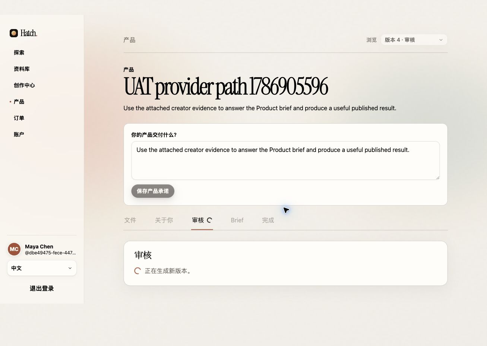

本次新建 Creator 的真实生产浏览器截图：

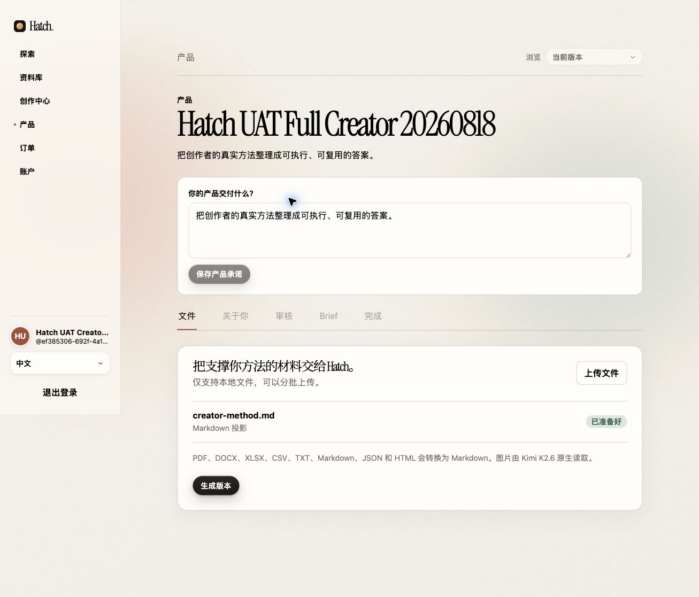

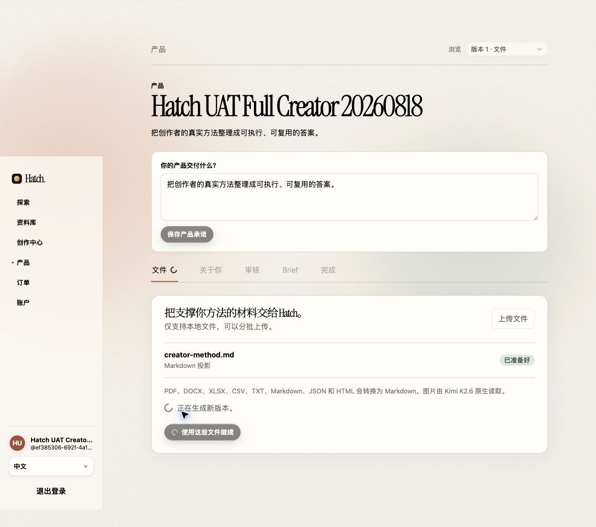

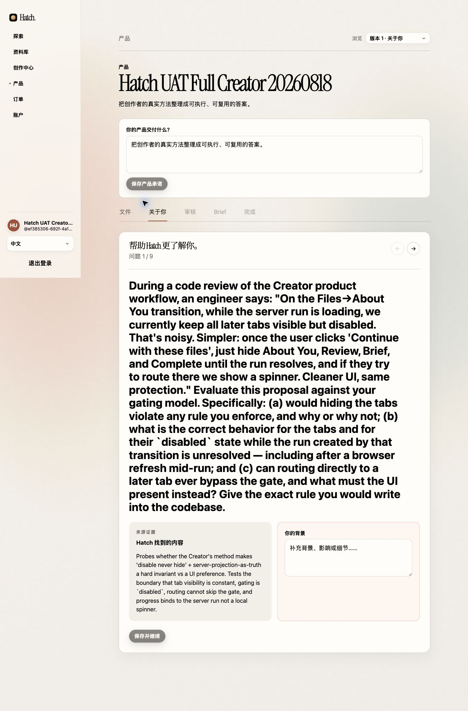

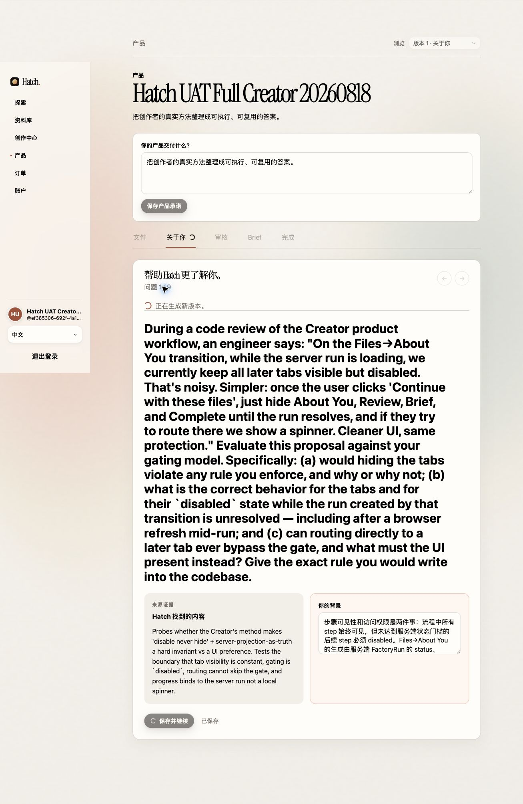

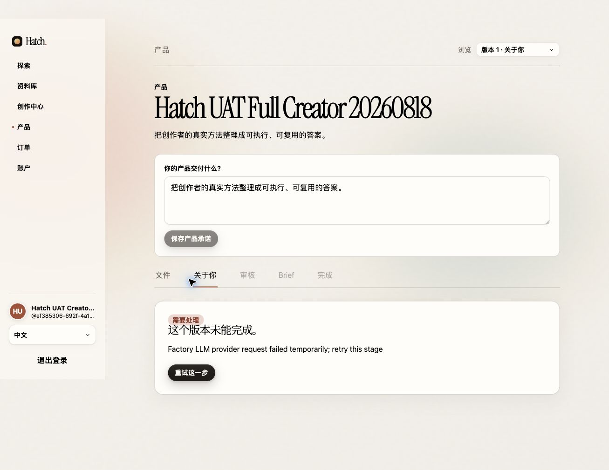

## 2. Data Structure / Source of Truth

### Product

`CreatorProductRecord` 是 Product identity 的唯一 authority：

```text
id                 stable Product UUID
creatorId          owning Creator
name
promise            buyer-facing delivery promise
briefSpec          creator-authored BriefSpec (published gate)
status             draft | active | published | withdrawn
resourceVersion    CAS/version for mutations
latestRevisionId   Product graph pointer, advanced only after immutable revision exists
```

### Product File / Snapshot

Product Files 是 Context Intake 和 Creator Studio 的共同输入边界；写入不会直接创建 Version/Run。

```text
ProductFile:
  id, artifactId, productId, displayName, mediaType, bytes, sha256
  projection: { kind, mediaType, sha256, bytes, content/base64 }
  metadata: { sourceKind, sourceRef, sourceUrl, provenance,
              selectionReason, creatorApproved, timeRanges }

ProductSnapshot:
  id, productId, fileIds, digest, createdAt
  immutable ordered source set used by one Factory revision
```

### Factory Run / Version

`FactoryRunRecord` + its immutable graph/artifacts determine the Creator workflow:

```text
id, productId, revisionNumber, parentRevisionId, sourceSnapshotId
status: queued | running | waiting_for_creator | ready | needs_attention
stage: extracting_evidence | awaiting_creator_answers |
       compiling_corpus | evaluating_development |
       evaluating_regression | evaluating_heldout |
       review_required | ready | needs_attention
workflowStep: files | about-you | review
version, pendingQuestions, answerDrafts, pendingAnswers
candidate: { version, digest/reportDigest, verified Corpus references }
retryStage, lastError, retryable
```

The UI must not derive progress from a local spinner or from an old run after a new Files command. The server-issued run (`status`, `stage`, `workflow_step`) is authoritative; after refresh or process restart the same projection reconstructs the current/loading/disabled state.

### Review projection

`GET /v1/creator/factory-runs/:id/review` is a read-only projection over the candidate:

```text
candidate_digest, candidate_version
cases[]: { id, question, creator_reference, candidate_output,
           verdict, diagnosis, case_digest, status }
blind: { sealed, total, passed, failed, needs_creator_action }
unresolved_count, correction_count, rerun_ready, release_ready
```

Held-out case text, answers and candidate output remain sealed. A failed sealed gate can only be advanced by explicit Creator correction (`heldout_correction`), which creates the next Version.

### Brief / buyer Task

`BriefSpec` is Product-owned and creator-authored. A buyer Task stores an immutable `BriefSnapshot` in the Conversation JSONB (spec digest + ordered answers). Runtime instructions remain authoritative; buyer answers are untrusted task material and cannot override Creator instructions.

```text
Conversation:
  id, entitlementId, creatorId, productId, status, title
  briefSnapshot: {
    id, specDigest, fields: [{ id, label, required, value }], submittedAt
  }
  messages[], events[], runs[]

Task/Run:
  conversationId, runId, status: queued | running | completed | failed
  startedAt, finishedAt, message/event references
```

`BriefSnapshot` 在创建 Conversation/Task 的同一请求中写入；同一 Task 后续不重复填写。Desktop refresh/reopen 只从 Conversation Library + Snapshot/Run projection 恢复，不从本地表单状态重建。

### Context Intake OAuth grant

The plugin stores only the durable OAuth grant locally (macOS Keychain in this UAT). Browser authorization uses Authorization Code + PKCE (`state`, CSRF, S256). Product-only scopes are:

```text
creator:products:read
creator:products:write
creator:files:read
creator:files:write
```

## 3. Creator UAT checklist

1. Sign in as a real Creator.
2. Create/select a Product and upload real Product Files.
3. Click **Continue with these files**. Verify Files shows loading, all later tabs are disabled, and refresh preserves this state.
4. Answer every About You question. On the final answer, verify Review becomes the loading current step and later tabs remain disabled; refresh once.
5. In Review, accept/correct/remove every known case. For a sealed failure, enter a Creator correction and why; verify a new Version is created and Review remains loading.
6. When Review is release-ready, open Brief, save at least one required question, then open Complete.
7. Before the final **Publish product** command, verify the candidate digest, BriefSpec and Product identity. Publish only as an explicit release decision.

Current evidence (2026-08-18, production): real Versions 2–5, About You answers, Review accept/correction, sealed held-out correction, Brief save, and refresh persistence were exercised on Product `1650bef0-5eda-4eee-a18e-f359a25f0598`. Version 5 reached Review `8/8` known cases and `3/3` sealed held-out cases, the Brief remained persisted after reload, and the final Complete/Publish path was exercised after the graph recovery deployment (`3972bec`). The canonical public storefront then loaded in the signed-in browser at [the Product URL](https://hatch.tokenquadrant.cn/products/1650bef0-5eda-4eee-a18e-f359a25f0598) and displayed “This is your published storefront.” This is production browser evidence for the Creator Product path; it is not Desktop OS UAT evidence.

## 4. Context Intake UAT checklist

1. Start `begin_browser_login` and open the returned authorization URL in the signed-in Hatch browser.
2. Confirm the consent page lists only Product and Product Files capabilities; approve it.
3. Finish the local callback and verify the creator identity without exposing the token.
4. Review a candidate Markdown artifact from approved creator context. Upload only with `creator_approved=true` and provenance metadata.
5. Read back the returned Product File receipt and verify `product_id`, `artifact_id`, bytes and SHA-256.

Observed in this UAT: Maya Chen OAuth/PKCE succeeded; `context-intake-uat.md` was uploaded to the Product Files of the Product above and read back with the same artifact and digest. The response explicitly confirmed that no Version or Run was changed.

Additional production evidence (2026-08-19, real Chrome session and real Creator account):

- The Hatch consent page identified `Hatch UAT Creator 20260818` and listed exactly the four Product/Product Files scopes above. The authorization used a fresh `state`, Authorization Code, and S256 PKCE challenge; the token exchange returned the same Creator identity and stored the grant in macOS Keychain without exposing the token.
- Chrome blocked the loopback callback page with `ERR_BLOCKED_BY_CLIENT`. The browser URL still contained the one-time callback parameters, so the exact state/code were delivered to the already-running local callback listener; the server accepted the state and PKCE verifier. This is a browser-extension callback limitation, not an OAuth endpoint failure. Evidence of the consent page: [context-intake-oauth-consent-20260819.png](screenshots/context-intake-oauth-consent-20260819.png).
- The authenticated intake client listed Product `Hatch UAT Full Creator 20260818` and read its existing Product Files. It uploaded the creator-approved Markdown artifact `context-intake-uat-20260819.md` from this guide with `source_kind=codex_session`, `provenance=creator_confirmed`, and `creator_approved=true`. The returned artifact was `artifact_ba5e1a39778ca02f051e142e96c2978e39ef9108dc0007a7287e5766088a642d`, 12,411 bytes, SHA-256 `ba5e1a39778ca02f051e142e96c2978e39ef9108dc0007a7287e5766088a642d`; the Product File receipt was `file_8f7895c2ecc99b7a9fbcb3eb121959ad78e54bcd`.
- A byte-identical replay returned the same file/artifact/digest and unchanged `updated_at`; a subsequent Product Files list contained exactly the original file plus this new file. Direct file verification returned the same metadata and projection digest. The upload response explicitly stated that no Version or Run was changed.

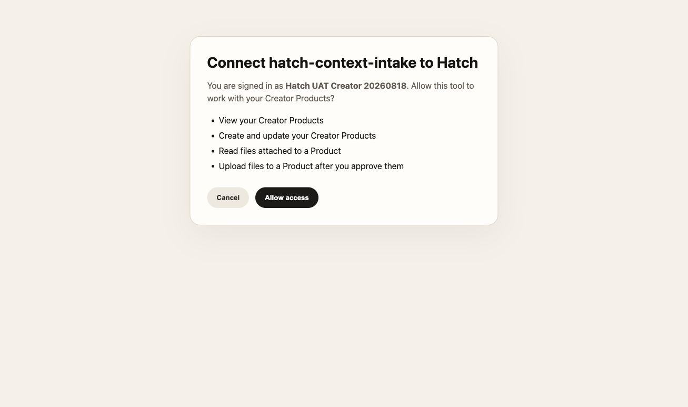

## 5. Buyer Desktop UAT

Use a real buyer account with entitlement to the published Product:

1. Open the acquired Product in the real Hatch Desktop build.
2. Read the published BriefSpec and fill required answers.
3. Submit once; verify immutable BriefSnapshot persistence and idempotent retry.
4. Confirm Conversation/Task creation, Agent start, and runtime instructions.
5. Refresh/reopen Desktop and verify the same Task and BriefSnapshot remain available read-only.

Observed in this UAT (2026-08-18, real production entitlement):

- Buyer display name: `Hatch UAT Buyer`; Product `1650bef0-5eda-4eee-a18e-f359a25f0598`; entitlement `7bb4af13-7a17-4f3b-820a-4188820b4dfa`.
- Desktop read the two-field published BriefSpec, accepted one required and one optional answer, and created Conversation `conv_70bcd77d0a4049358da1c4f3f19d563d` with immutable `BriefSnapshot` `brief_9f893ef2428346bfba8b1a51c90e8d94` and digest `sha256:44fcae87d90d05803b777577ed789b719551d1b7f3757798b4237fe7b1fa3fe9`.
- The same submit immediately started Agent Run `run_0a23fc63ed704922a046d7154ace0771`; it reached `completed` after real file listing/reads, approval prompts, and a real workspace write to `Hatch HTTP UI Acceptance 20260718/UAT-findings-decision-first.md`.
- After quitting and reopening the latest real `target/release` Hatch build, the Task Brief remained read-only and the Conversation/run history restored with status `Worked`.

Screenshots:

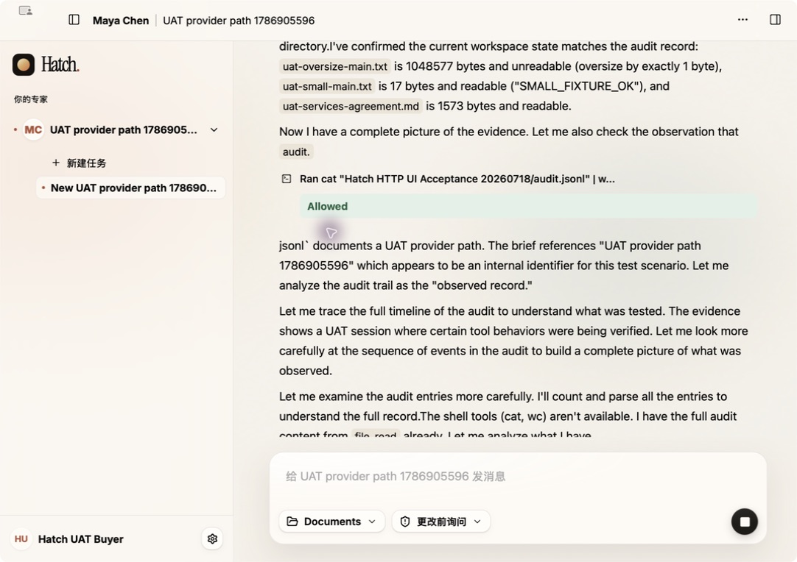

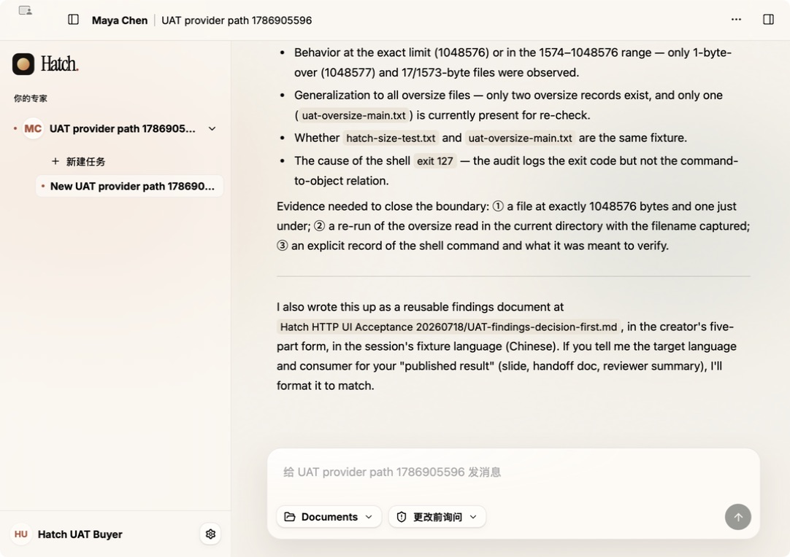

This is Desktop OS UAT on a real local product build with production Registry/Runtime and a real entitlement; it is not a signed production Desktop release. Do not use a fixture, preview bundle, synthetic entitlement or fake success state as evidence for this section.

### Latest Buyer evidence (2026-08-19)

The follow-up run used a newly created real Buyer account, `Hatch UAT Buyer 20260819`, and the same published Product. The real Desktop build showed the published BriefSpec, accepted the required and optional answers, created one immutable BriefSnapshot, and started the Agent immediately. After the app was quit and reopened, the same Product, Task, Conversation and final Agent output were restored from the server projection.

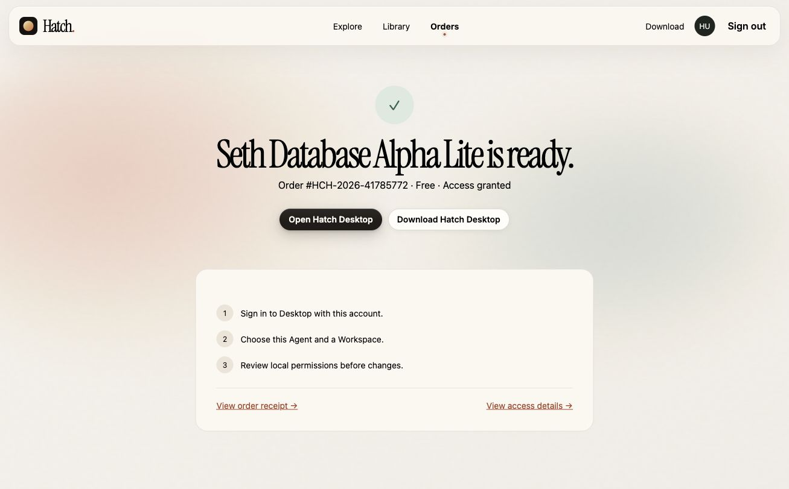

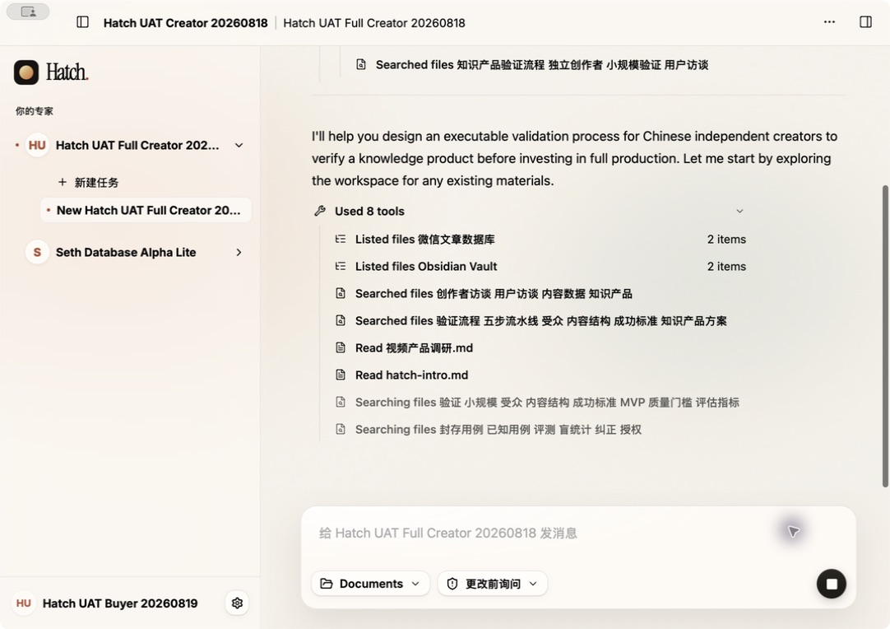

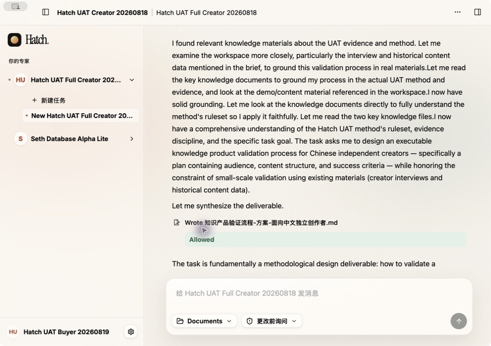

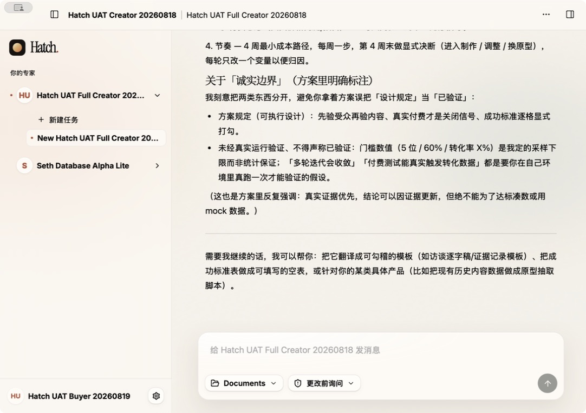

## 6. Evidence levels

| Evidence | Meaning |
| --- | --- |
| Unit/component | Contract or rendering behavior only |
| Focused HTTP/integration | Real server modules and persistence boundaries, usually test-controlled dependencies |
| Production browser | Signed-in UI plus deployed backend/provider and durable state |
| Desktop OS UAT | Real Hatch Desktop build, entitlement, native bridge and Agent |

Only the last two levels can close product UAT. Provider quota, signed browser OAuth, production Postgres/Object Storage and Desktop OS state must be reported separately from green unit tests.

## 7. End-to-end data flow

```text
Creator Files
  └─ ProductFile (immutable source + projection)
       └─ Continue → ProductSnapshot → FactoryRun (queued/running)
            └─ About You answer draft/submission (CAS + question_batch_id)
                 └─ immutable Version / Candidate / Corpus + sealed evaluations
                      └─ Review adjudications or correction → new Version
                           └─ BriefSpec (creator-owned, persisted on Product)
                                └─ release intent (Product status = publishing)
                                     └─ Registry activation → Product status = published
                                          └─ Buyer entitlement → Desktop BriefSpec
                                               └─ BriefSnapshot in Conversation JSONB
                                                    └─ Conversation/Task → Agent Run
```

At every arrow the UI reads a server projection. `run.status`, `run.stage`, `workflow_step`, immutable artifact/revision identity and Product `status` determine the current step, loading indicator, disabled tabs and retry surface. The browser's local `busy` flag is only a command guard; it is never the source of truth. Product Files upload does not create a Version or Run, and the Context Intake upload replay proved that the same idempotency key returns the same file/artifact/digest without adding another file.

Implementation note: Product mutation CAS compares the Postgres timestamp at the API's millisecond precision; hidden database microseconds must not turn a freshly read Product into a false `version_conflict`.
