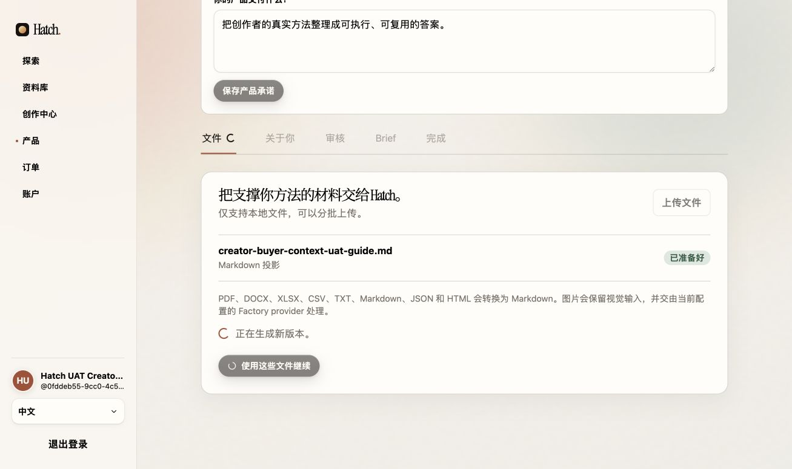
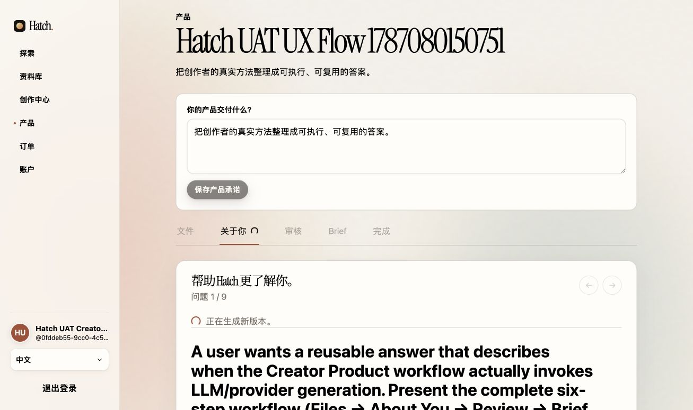
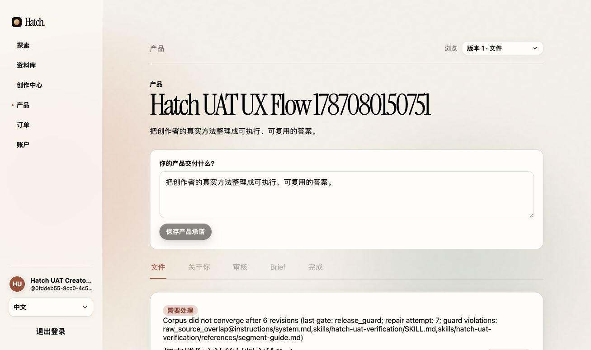

# Hatch 用户旅程指南

这是一份给真实用户和 UAT 测试者看的指南。

你不需要了解数据库、模型、队列或接口。你只需要知道三件事：

1. Creator 如何把自己的经验变成一个别人可以使用的 Product。
2. Coding Agent 如何把 Creator 已经确认过的内容安全地交给 Product。
3. Buyer 如何购买 Product、提出自己的问题，并拿到可以继续使用的结果。

## 先看结论

Hatch 不是让你“配置一个 AI”。它要帮你完成一件具体的事：

- Creator 把自己的方法、案例和边界交给 Hatch。
- Hatch 帮 Creator 整理成一个可以检查、修改和发布的 Product。
- Buyer 只需说明自己的情况，Product 就能用这套方法帮助 Buyer 完成任务。

整个过程中，系统会告诉你现在发生了什么、下一步是什么，以及出错后如何继续。你不需要记住内部步骤，也不需要手动复制授权码或 token。

## 一、Creator：把自己的方法变成可用的 Product

### 1. 先说清楚你要交付什么

登录 Creator 账号，创建一个 Product，写下两件事：

- 名称：别人能认出它是什么。
- 承诺：别人使用它后，能得到什么结果。

承诺不是技术说明，也不是“使用某某模型”。它应该描述用户真正想拿走的结果，例如：

> 帮助创作者把零散经验整理成可以执行、可以复用的答案。

如果你自己不能用一句话说清楚结果，先不要急着上传文件。Product 的名称和承诺会一直跟着后面的检查、购买和使用过程。

### 2. Files：把材料交给 Hatch

上传你愿意交给 Product 使用的材料，例如文章、笔记、案例、视频整理稿或方法说明。

上传完成只代表材料已经保存。它不会偷偷开始生成，也不会因为重复点击而自动产生很多版本。

确认材料无误后，点击 **Continue with these files**（使用这些文件继续）。这一步才会开始整理。

点击后你会看到：

- Files 显示正在处理。
- About You、Review、Brief、Complete 仍然显示，但暂时不能点击。
- 刷新页面或暂时离开后，回来仍然能看到同一个处理状态。

这不是让你等待一个黑箱。页面会保留你的材料和进度；处理成功后会自动进入 About You，处理失败时会保留已有内容并给出下一步。

### 3. About You：告诉系统哪些内容最重要

Hatch 会根据你的材料提出问题。问题的目的不是让你重新写一遍材料，而是确认：

- 你的方法真正解决什么问题。
- 哪些判断最重要。
- 哪些情况不能照搬。
- 什么样的答案才算符合你的标准。

用你平时会对同事或客户说的话回答即可，不需要使用模型术语。你可以先保存答案，最后确认全部回答后再继续。

提交最后一个回答后，系统会进入下一段处理：

- About You 显示正在整理。
- Review、Brief、Complete 仍然锁定。
- 刷新后状态不会丢失。

### 4. Review：判断结果是否真的像你的方法

Review 会把 Product 放进一些真实使用场景里，让你检查它的回答。

你要做的不是给系统打分，而是判断：

- 这个回答是否解决了问题。
- 它是否使用了正确的方法。
- 它是否越过了你设定的边界。
- 如果不满意，应该怎样改。

你可以接受一个回答，也可以指出问题并重新整理。每次重要修改都会形成一个新的版本，旧版本仍然保留，所以你不会因为一次修改而丢失之前的成果。

Review 通过后，Brief 才会解锁。Brief 之前的步骤不会被“跳过”，而是由系统确认已经完成后再向前开放。

### 5. Brief：告诉 Buyer 开始前需要提供什么

Brief 是你写给 Buyer 的开始问题。

例如，你可以要求 Buyer 提供：

- 目标是什么。
- 当前遇到的情况是什么。
- 有哪些限制或截止时间。

把真正影响结果的问题标记为必填，不重要的问题设为可选。问题应该让 Buyer 容易回答，而不是要求 Buyer 理解你的内部流程。

保存 Brief 后，系统会把它作为 Product 的一部分。Buyer 开始一个新任务时会填写一次；同一个任务之后不会反复要求填写。

### 6. Complete 和 Publish：决定是否交付

在 Complete 页面，最后检查：

- Product 名称是否准确。
- 交付承诺是否仍然成立。
- Review 中的结果是否可以接受。
- Brief 是否足够帮助 Buyer 开始。

只有你明确点击发布，Product 才会进入发布过程。发布期间：

- Complete 显示正在发布。
- 其他编辑步骤保持锁定。
- 刷新页面后仍然显示发布中。
- 只有真正发布成功，页面才会显示已发布。

发布完成后，用 Buyer 视角打开 Product 链接，亲自完成一次任务。Creator 的完成不是“按钮变绿”，而是 Buyer 能够得到可以使用的结果。

## 二、哪些操作会触发 AI 处理

你只需要记住三类：

| 你的动作 | 系统会做什么 |
| --- | --- |
| Files 点击继续 | 根据材料整理 About You 问题 |
| About You 提交最后答案 | 整理 Product 并准备 Review |
| Review 修改后重新检查 | 生成新的版本并重新检查 |

下面这些动作不会偷偷触发新的 AI 生成：

- 上传或重新上传文件。
- 保存 Brief。
- 在 Review 中做接受或发布决定。
- 最终发布 Product。

这意味着你始终知道什么时候系统在工作，什么时候决定权在你手里。

## 三、Context Intake：从 Coding Agent 带入已确认的内容

Context Intake 适合把你已经确认过的内容带进 Product，例如：

- 你和 Coding Agent 讨论过的方法。
- 你自己的视频转写和整理稿。
- 你明确批准过的案例、问答或经验总结。

### 普通用户的完整流程

1. 在 Coding Agent 中点击 **Connect Hatch** 或 **Authorize**。
2. 浏览器打开 Hatch 授权页；确认显示的是你自己的 Creator 账号和 Product 文件权限。
3. 点击同意。
4. 浏览器自动回到 Coding Agent，插件自动完成授权交换并保存授权状态。
5. 选择要带入的内容，先预览，再明确确认。
6. 选择目标 Product，点击上传。
7. 插件显示上传结果；你可以在 Hatch 的 Product Files 页面看到同一份文件。

用户不需要复制 code、手动运行命令，也不应该看到 token。相同内容重试时，系统会复用原文件，不会悄悄增加重复文件，也不会因此自动创建新 Version 或 Run。

### 你需要特别确认什么

上传前确认三件事：

- 这些内容确实属于你，或你有权使用。
- 你已经看过预览并同意上传。
- 你选择了正确的 Product。

Context Intake 只负责把已批准的材料放进 Product Files。它不会替你完成 Creator 的 Review，也不会替你发布 Product。

### 授权页面没有自动返回时

正常情况下 callback 会自动完成，用户不需要介入。如果浏览器扩展拦截了回跳页面，插件应自动继续处理；如果仍然无法完成，页面应明确显示“授权未完成，请重试”，而不是让用户复制授权码或接触 token。

本次真实 UAT 已验证授权、文件上传、读取核对和重复上传保护；浏览器回跳被拦截属于当前扩展兼容性边界，已记录为待优化体验，不改变授权权限边界。

## 四、Buyer：用 Product 完成自己的任务

### 1. 打开 Product 并确认你获得了访问权限

从 Creator 分享的 Product 链接进入。登录后，你应该能看到：

- Product 是谁创建的。
- 它承诺帮你完成什么。
- 开始前需要回答哪些问题。

如果看不到 Product 或没有访问权限，先解决访问问题，不要重复创建任务。

### 2. 填写开始问题

只回答和这次任务有关的内容。必填问题必须回答，可选问题只在它确实能帮助结果时填写。

提交后，系统会把这次回答保存为任务的开始资料。之后重新打开同一个任务时，不会要求你重复填写，也不会用新的答案覆盖旧任务。

### 3. 让 Product 立即开始工作

提交后，任务会自动开始。你可以看到：

- 任务正在处理。
- Product 正在使用哪些材料或工具。
- 最终结果是否已经完成。

你不需要手动启动第二次 Agent。若任务失败，页面应保留已有信息并告诉你是否可以重试。

### 4. 关闭后再回来

退出 Desktop，再次打开同一个 Product，你应该能看到原来的任务、开始资料和结果。恢复的是服务器保存的真实任务，不是本地临时表单。

## 五、什么算真正完成

### Creator

- 你知道 Product 要帮谁取得什么结果。
- 你提供了自己愿意交付的材料。
- 你检查并修改了 Product 的回答。
- 你写清楚 Buyer 开始前要提供什么。
- 你明确发布，并能用 Buyer 视角完成一次任务。

### Context Intake

- 你看过内容并明确批准上传。
- 你能在目标 Product 中找到上传的文件。
- 重试不会出现重复文件。
- 你没有因为上传而意外创建新的生成任务。

### Buyer

- 你理解 Product 能帮你做什么。
- 你只填写一次这项任务需要的开始信息。
- Product 自动开始工作。
- 关闭再打开后，任务和结果仍然存在。

## 六、出错时怎么继续

遇到错误时，先看页面回答了哪四件事：

1. 发生了什么。
2. 已经完成的内容是否还在。
3. 系统为你保留了什么。
4. 现在可以做什么。

好的错误不会要求你从头开始。通常可以：

- 重试当前步骤。
- 修改刚才的回答后继续。
- 替换有问题的材料。
- 回到最近一个可以确认的步骤。

如果页面显示正在处理，后续步骤暂时不能点击是有意保护，不代表你的材料丢失。刷新后仍应看到相同状态。

真实 UAT 中还验证了一条保护性失败路径：当输入材料包含不应直接复制到最终 Product 的原文时，系统会停止发布并显示需要处理，而不是把不安全的结果交付给 Buyer。这是保护用户信任的行为，不是“生成成功”。

## 七、给 UAT 测试者的最短清单

### Creator

- [ ] 创建真实 Creator 账号和 Product。
- [ ] 上传真实、已确认可以使用的材料。
- [ ] 点击继续，确认当前步骤 loading、后续步骤 disabled。
- [ ] 刷新，确认状态没有丢失。
- [ ] 回答 About You，检查 Review 结果。
- [ ] 接受或修改结果，确认修改后可以继续。
- [ ] 写好 Brief，确认必填和可选问题清楚。
- [ ] 发布前检查 Product 承诺和结果。
- [ ] 发布后用 Buyer 视角完成一次真实任务。

### Context Intake

- [ ] 真实登录并完成授权。
- [ ] 只批准自己的内容。
- [ ] 上传到正确的 Product。
- [ ] 在 Product Files 中读回并核对。
- [ ] 用相同内容重试，确认没有重复文件。

### Buyer Desktop

- [ ] 用真实 Buyer 账号打开已获得访问权的 Product。
- [ ] 填写必填开始问题。
- [ ] 确认任务自动开始。
- [ ] 等待并检查结果。
- [ ] 退出和重开 Desktop，确认任务仍然存在。

## 八、这次真实 UAT 的结论

正常 Creator 主路径已经真实走通：从材料、问题、Review、Brief 到发布，并验证了修改版本和发布后的 Buyer 使用。

Context Intake 已真实走通授权、内容确认、上传、读回和幂等重试。

Buyer Desktop 已真实走通访问 Product、填写开始问题、自动启动任务、得到结果以及退出后恢复。

另外，系统也真实展示了保护性失败：当内容不适合直接进入可交付 Product 时，流程会停在需要处理，而不是伪造完成。UAT 记录应把“结果可用”和“系统正确拒绝不安全输入”分别记录，不能把错误页面当成成功。

完整截图和技术审计证据仍保留在 [技术证据版 UAT 指南](creator-buyer-context-uat-guide.md)。

